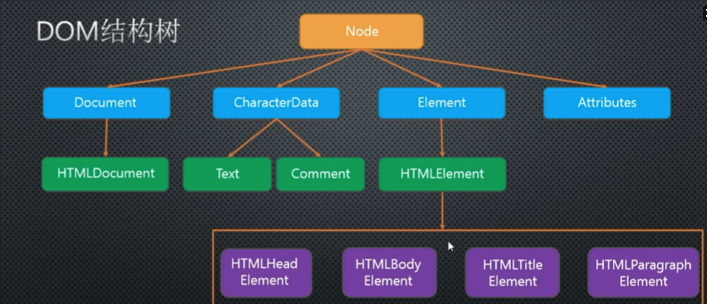
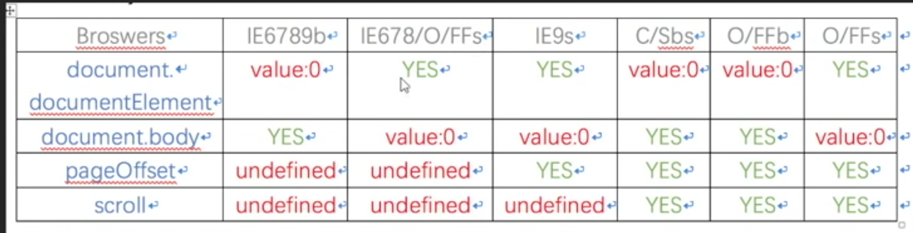

# Dom
## Dom说明
- 文档对象模型
- 提供操作HTML/XML的一套规范，DOM不能直接操作CSS

## JS对象
1. 本地对象
  - Object Function Array String Number Boolean Error EvalError SyntaxError RangeError ReferenceError TypeError RangeError Date RegExp
2. 内置对象(Build-in Object)
  - Global Math
  - isNaN parseInt Number DecoreURI encodeURI Infinity NaN undefined
  - 本地对象和内置对象都是ES内部对象
3. 宿主对象(Host Object)
  - 执行JS脚本的环境提供的对象，不同浏览器可能实现不同，存在兼容性问题
  - BOM DOM

## 节点
  - 节点(node)包含元素(element)也成为元素节点或DOM元素
  - 节点种类
    1. 元素节点 1
    2. 属性节点 2
    3. 文本节点 3
    4. 注释节点 8
    5. document 9
    6. DocumentFragment 11
### 节点属性
  1. nodeType
  - 只读
  - 获取节点种类对应的数字
  2. nodeName
  - 只读属性
  - 返回大写标签名或节点名(#text)
  3. nodeValue
  - 可写属性
  - 属性节点、文本节点、注释节点可用
### 获取节点方法
  1. document.parentNode
  - 一个子元素只有一个父元素，document的父元素为null
  2. childNodes
  - 获取子节点集合
  3. firstChild/lastChild
  - 获取某节点下第一个或最后一个节点
  4. nextSibling/previousSibling
  - 上一个/下一个兄弟节点
### 获取元素方法
  1. parentElement
   - 获取父元素节点
  2. children 子元素IE7及以下不支持
  3. childElementCount = children.length IE9及以下不支持
  4. firstElementChild/lastElementChild IE9及以下不支持
  5. nextElementSibling/previousElementSibling IE9及以下不支持
  6. getElementsByTagName()
   - 通过标签名获取一组元素
   - 存在于Document和Element原型中,Element只选择标签下的元素
  7. getElementsByClassName
   - 通过样式名获取一组元素
   - IE8以下不支持
   - 存在于Document和Element原型中
  8. getElementById
   - 通过id名获取元素
   - IE8以下不区分大小写
   - 仅存在于Document下，所以Element实例没有该方法(div.getElementById() undefiend)
  9.  getElementsByName
   - 通过标签的name属性获取一组元素
   - IE9以下只能用于有name属性的标签
   - 仅存在于Document下
  10. querySelector / querySelectorAll
   - 通过CSS选择器选择第一个/一组匹配的元素
   - IE8以下没有该方法，性能较低，不能实是更新(缓存)
   - 存在于Document和Element原型中
  11. document.documentElement直接获取整个html文档
  ### 节点操作
  1. createElement(str)
   - 存在于Document
   - 创建元素节点
  2. createTextNode(content)
   - 创建文本节点
  3. createComment(content)
  4. appendChild
   - 增加子节点
   - 剪切已有的节点，添加到某个节点下
   - 存在于顶层Node原型中
  5. insertBefore(a, b)
   - 存在于顶层Node原型中
   - 在父级节点下的子节点b之前插入a节点
  6. removeChild
   - 存在于顶层Node原型中
   - 删除子节点
   - 返回值是删除的节点
  7. replaceChild(new, origin)
   - new节点替换origin节点
  8. innerText/innerHTML 
   - innerHTML返回带有标签
   - innerText只返回文本
   - 在innerText中添加标签并不会被识别为HTML，因为标签的<>被转换为字符实体
   - 火狐老版本不支持inneText, textContent替代
  9. setAttribute(attrName, value)/getAttribute(attrName)
  10. document.createDocumentFragment
    - 创建文档片段，节点容器
    - 不在render tree中的节点内添加节点，避免回流
    - 相比字符串拼接性能慢(div.innerHTML = '<li></li>')

## DOM结构

  - document 继承于  HTMLDocument / XMLDocument 继承于 Document。因此document不能直接继承于Document，而是由HTMLDocument / XMLDocument继承于Document，再由document继承
  - Text(文本节点原型) Comment(注释节点原型)继承于CharacterData
  - Element是元素节点的构造函数
  - HTMLDocument下有body和head属性，可以选择到HTMLBodyElement和HTMLHeadElement的元素实例

## 滚动，兼容模式，可视尺寸
### 滚动条距离
- 页面相比可视窗口上移或向右移动的距离

1. window.pageXOffset/window.pageYOffset
   - IE9/IE8及以下不支持
2. document.body.scrollLeft/scrollTop
3. document.documentElement.scrollLeft/scrollTop
4. window.scrollX/scrollY
```javascript
function getScrollOffset() {
  if (window.pageXOffset) {
    return {
      left: window.pageXOffset,
      top: window.pageYOffset
    }
  } else {
    retrun {
      left: document.body.scrollLeft + document.documentElement.scrollLeft,
      top: document.body.scrollTop + document.documentElement.scrollTop
    }
  }
}
```

### 操作滚动条
1. window.scroll(x, y) window.scrollTo(x, y)
2. window.scrollBy(x, y)

### 浏览器可视区域尺寸(窗口的宽高)
1. window.innerWidth/innerHeight
2. document.documentElement.clientWidth/clientHeight
   - IE8/IE9及以下
   - 标准模式
3. document.body.clientWidth/clientHeight
   - 怪异模式
```javascript
function getViewPort() {
  if (window.innerWidth) {
    return {
      width: window.innerWidth,
      height: window.innerHeight
    }
  } else if (document.compatMode === 'BackCompat') {
    return {
      width: document.body.clientWidth,
      height: document.body.clientHeight
    }
  } else {
    return {
      width: document.documentElement.clientWidth,
      height: document.documentElement.clientHeight
    }
    width: document.documentElement.clientWidth,
    height: document.documentElement.clientHeight
  }
}
```
4. outerWidth/outerHeight
   - 浏览器全部区域(除标签栏)

### 页面宽高
可视区域 + 滚动距离
1. document.body.scrollHeight/scrollWidth 
2. document.socumentElement.scrollHeight/scrollWidth
```javascript
function getScrollSize() {
  if (document.body.scrollWidth) {
    return {
      width: document.body.scrollWidth,
      height: document.body.scrollHeight
    }
  } else {
    return {
      width: document.documentElement.scrollWidth,
      height: document.documentElement.scrollHeight
    }
  }
}
```

### offsetLeft/offsetTop
- 元素距离父级定位元素或可视区域边框的距离
```javascript
function getEleDocPosition(el) {
   var parent = el.offsetParent // 获取有定位的父元素
   var offsetLeft = el.offsetLeft  
   var offsetTop = el.offsetTop

   while (parent) {
     offsetLeft += parent.offsetLeft
     offsetTop += parent.offsetTop
     parent = parent.offsetParent
   }

   return {
     left: offsetLeft,
     top: offsetTop
   }
}
```

### 鼠标行为
#### 坐标系
  1. clientX/Y 鼠标位置相对于当前可视区域的坐标，不包括滚动条距离
  2. layerX/Y 同pageX/Y，IE11下同clientX/Y
  3. screenX/Y 鼠标位置相对于屏幕的坐标
  4. x/y 同clientX/Y相同，firefox不支持
  5. pageX/pageY 相对于当前文档的坐标，包含滚动条距离，IE9以下不支持
  6. offsetX/Y 鼠标位置相对于块元素的坐标，包含边框，safari不包括
```javascript
// 鼠标相对于文档的坐标s，实现pageX/Y
function pagePos(e) {
  var sLeft = getScrollOffset().left, //滚动距离
      sTop = getScrollOffset().top,
      cLeft = document.documentElement.clientLeft || 0, //文档偏移，document自带margin(css样式设置为0时，计算时还会出现)
      cTop = document.documentElement.clientTop || 0

  return {
     X: e.clientX + sLeft - cLeft,
     Y: e.client + sTop - cTop
  }
}
```

#### 鼠标事件
```html
<!DOCTYPE html>
<html lang="en">
<head>
  <meta charset="UTF-8">
  <meta name="viewport" content="width=device-width, initial-scale=1.0">
  <title>Document</title>
  <style type="text/css">
    .body {
      margin: 0;
    }
    
    a {
      position: absolute;
      top: 0;
      left: 0;
      width: 100px;
      height: 100px;
      background-color: orange;
    }

    div {
      display: none;
      position: absolute;
      top: 0;
      left: 0;
      width: 100px;
      height: 100px;
      background-color: lightblue;
    }
  </style>
</head>
<body>
  <a href="javascript:;"></a>
  <div></div>
  <script src="./utils.js"></script>
  <script src="./dragNclick.js"></script>
  <script>
    var olink = document.getElementsByTagName('a')[0],
        oMenu = document.getElementsByTagName('div')[0]
    olink.dragNclick(oMenu, function () {
      window.open('http://www.baidu.com')
    })
  </script>
</body>
</html>
```
```javascript
// **拖拽元素**
Element.prototype.dragNclick = (function(menu, elemClick) {
  var sTime = 0,
      eTime = 0,
      oPos = [],
      cbTime = 0,
      ceTime = 0,
      counter = 0,
      timer = null;
      wWidth = getViewPort().width,
      wHeight = getViewPort().height,
      eleWidth = getStyles(this, 'width'),
      eleHeight = getStyles(this, 'height'),
      mWidth = getStyles(menu, 'width'),
      mHeight = getStyles(menu, 'height');

  function drag() {
    var x,
        y,
        _self = this
  
    addEvent(this, 'mousedown', function (e) {
      console.log(e)
      var e = e || window.event,
          btnCode = e.btnCode;

      if (btnCode === 2) {
        var mLeft = pagePos(e).X,
            mTop = pagePos(e).Y;
        
        if (mLeft <= 0) {
          mLeft = 0;
        } else if (mLeft >= wWidth - mLeft) {
          mLeft = pagePos(e).X - mWidth
        }

        if (mTop <= 0) {
          mTop = 0;
        } else if (mTop >= wHeight - mHeight) {
          mTop = pagePos(e).Y - mHeight
        }

        menu.style.left = mLeft + 'px';
        menu.style.top = mTop + 'px';
        menu.style.display = 'block';
      } else if (btnCode === 0) {
        sTime = new Date().getTime()
        oPos = [getStyles(_self, 'left'), getStyles(_self, 'top')]
        menu.style.display = 'none'

        x = pagePos(e).X - getStyles(_self, 'left');
        y = pagePos(e).Y - getStyles(_self, 'top');
    
        addEvent(document, 'mousemove', mouseMove);
        addEvent(document, 'mouseup', mouseUp);
        cancelBubble(e);
        preventDefaultEvent(e)
      }
    })

    addEvent(document, 'contextmenu', function (e) {
      var e = e || window.event;
      preventDefaultEvent(e)
    })

    // 鼠标点击menu外时，不显示menu
    addEvent(document, 'click', function (e) {
      menu.style.display = 'block'
    })
    // 点击menu时阻止事件冒泡
    addEvent(menu, 'click', function (e) {
      var e = e || window.event;
      cancelBubble(e)
    })
  
    function mouseMove(e) {
      var e = e || window.event,
          eleLeft = pagePos(e).X - x,
          eleTop = pagePos(e).Y - y;
      
      if (eleLeft <= 0) {
        eleLeft = 0;
      } else if (eleLeft >= wWidth - eleWidth) {
        eleLeft = wWidth - eleWidth - 1
      }

      if (eleTop <= 0) {
        eleTop = 0;
      } else if (eleTop >= wHeight - eleHeight) {
        eleTop = wHeight - eleHeight - 1
      }

      _self.style.top = eleTop + 'px';
      _self.style.left = eleLeft + 'px';
    }
  
    function mouseUp(e) {
      var e = e || window.event;
      eTime = new Date().getTime()

      if (eTime - sTime < 100) {
        // click
        // 防止click与拖拽事件重合
        _self.style.top = oPos[1] + 'px';
        _self.style.left = oPos[0] + 'px';
        
        counter++;
        if (counter === 1) {
          cbTime = new Date().getTime();
        }

        if (counter === 2) {
          ceTime = new Date().getTime();
        }

        if (cbTime && ceTime && (ceTime - cbTime < 200)) {
          // 双击
          elemClick()
        }

        timer = setTimeout(function () {
          cbTime = 0
          ceTime = 0
          counter = 0
          clearTimeout(timer)
        }, 500)
      }

      removeEvent(document, 'mousemove', mouseMove);
      removeEvent(document, 'mouseup', mouseUp);
    }
  }

  drag.call(this);
});
```
  - 左、中、右键通过event.btnCode(0 1 2)区分，click事件没有该属性，mousedown和mouseup有该属性。使用IE10及以上

## 浏览器怪异模式和标准模式
document.compatMode CSS1Compat(标准模式) BackCompat(怪异模式)
### 标准模式
- \<!DOCTYPE html>
- 兼容w3c dom规范
### 怪异模式
- 浏览器兼容自己之前版本，忽略w3c规范

## DOM间接修改css
### 获取元素样式
1. window.getComputedStyle(elem, null)
   - 查看计算样式
   - 第二个参数是元素的伪元素，获取伪元素的样式，只读
   - 操作伪元素需要该样式类
```javascript
function getStyles(elem, prop) {ß
  if (window.getComputedStyle) {
    if (prop) {
      return window.getComputedStyle(elem, null)[prop]
    } else {
      return window.getComputedStyle(elem, null)
    }
  } else {
    if (prop) {
      return elem.currentStyle[prop]
    } else {
      return elem.currentStyle
    }
  }
}
```

# js事件
- 绑定事件 = 绑定事件的处理函数
- 事件 + 事件反馈 = 前段交互
## 绑定事件处理函数
  1. elem.onclick = function
  2. elem.addEventListener(事件类型， 事件处理函数， 是否禁用冒泡)
```javascript
function addEvent(el, type, fn) {
  if (el.addEventListener) {
    el.addEventListener(type, fn, false)
  } else if (el.attavhEvent) {
    el.attachEvent('on' + type, function () {
      fn.call(el)
    })
  } else {
    type = 'on' + type
    el[type] = fn
  }
}
```
## 解除事件绑定函数
  1. elem.onclick = null
  2. elem.removeEventListener(事件类型，事件处理函数，false)
```javascript
function removeEvent(elem, type, fn) {
  if (elem.addEventListener) {
    elem.removeEventListener(type, fn, false)
  } else if (elem.attachEvent) {
    elem.detachEvent('on' + type, fn)
  } else {
    elem['on' + type] = null
  }
}
```

## 事件冒泡和捕获
- 先执行捕获，再执行冒泡，在事件源上根据事件绑定顺序执行
### 冒泡
- dom元素从里向外触发相同类型的事件的回调
### 捕获
- dom元素从外向里触发相同类型的事件的回调
### 取消冒泡
```javascript
elem.addEventListener('click', function (e) {
  var e = e || window.event //IE8
  e.stopPropagation()
}, false)

function cancelBubble(e) {
  var e = e || window.event //IE8
  if (e.stopPropagation) {
    e.stopPropagation()
  } else {
    e.cancelBubble = true
  }
}
```
### 取消默认事件
event.preventDefault
event.returnValue = false(IE9及以下)
```javascript
function preventDefaultEvent(e) {
  var e = e || window.event
  if (e.preventDefault) {
    e.preventDefault()
  } else {
    e.returnValue = false
  }
}
```

## 事件流
- 事件捕获，处于目标阶段，事件冒泡

## 事件对象/事件源对象/事件代理
- 事件会被javascript包装为事件对象，传入事件处理函数的第一个参数
```javascript
elem.onclick = function (event) {
  var event = event || window.event
}
```
- 触发事件的节点
```javascript
elem.onclick = function (event) {
  var event = event || window.event
    tar = event.target || event.srcElement
  console.log(tar)
}
```
- 事件代理
通过为父元素绑定相应事件，利用子元素的的事件冒泡触发父元素的对应事件，避免为每一个子元素绑定事件
```javascript
elem.onclick = function (event) {
  var event = event || window.event
    tar = event.target || event.srcElement

  var index = Array,prototype.indexOf(parent, children)
  console.log(tar)
}
```

## 鼠标移入移出事件

### mouseover mouseout
- 对绑定元素和子元素都生效

### mouseenter mouseleave
- 只对绑定元素生效
