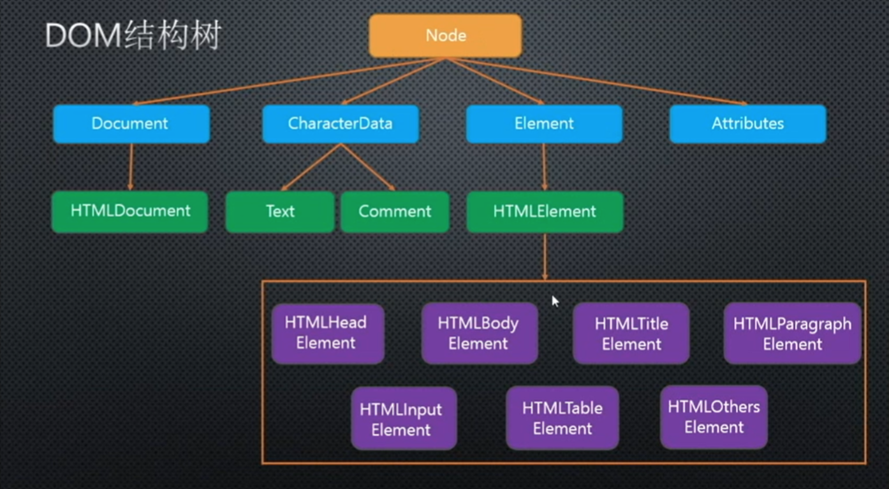

# Dom
## Dom说明
- 文档对象模型
- 提供操作HTML/XML的一套规范，DOM不能直接操作CSS

## JS对象
1. 本地对象
  - Object Function Array String Number Boolean Error EvalError SyntaxError RangeError ReferenceError TypeError RangeError Date RegExp
2. 内置对象(Build-in Object)
  - Global Math
  - isNaN parseInt Number DecoreURI encodeURI Infinity NaN undefined
  - 本地对象和内置对象都是ES内部对象
3. 宿主对象(Host Object)
  - 执行JS脚本的环境提供的对象，不同浏览器可能实现不同，存在兼容性问题
  - BOM DOM

## 节点
  - 节点(node)包含元素(element)也成为元素节点或DOM元素
  - 节点种类
    1. 元素节点 1
    2. 属性节点 2
    3. 文本节点 3
    4. 注释节点 8
    5. document 9
    6. DocumentFragment 11
### 节点属性
  1. nodeType
  - 只读
  - 获取节点种类对应的数字
  2. nodeName
  - 只读属性
  - 返回大写标签名或节点名(#text)
  3. nodeValue
  - 可写属性
  - 属性节点、文本节点、注释节点可用
### 获取节点方法
  1. document.parentNode
  - 一个子元素只有一个父元素，document的父元素为null
  2. childNodes
  - 获取子节点集合
  3. firstChild/lastChild
  - 获取某节点下第一个或最后一个节点
  4. nextSibling/previousSibling
  - 上一个/下一个兄弟节点
### 获取元素方法
  1. parentElement
   - 获取父元素节点
  2. children 子元素IE7及以下不支持
  3. childElementCount = children.length IE9及以下不支持
  4. firstElementChild/lastElementChild IE9及以下不支持
  5. nextElementSibling/previousElementSibling IE9及以下不支持
  6. getElementsByTagName()
   - 通过标签名获取一组元素
   - 存在于Document和Element原型中,Element只选择标签下的元素
  7. getElementsByClassName
   - 通过样式名获取一组元素
   - IE8以下不支持
   - 存在于Document和Element原型中
  8. getElementById
   - 通过id名获取元素
   - IE8以下不区分大小写
   - 仅存在于Document下，所以Element实例没有该方法(div.getElementById() undefiend)
  9.  getElementsByName
   - 通过标签的name属性获取一组元素
   - IE9以下只能用于有name属性的标签
   - 仅存在于Document下
  10. querySelector / querySelectorAll
   - 通过CSS选择器选择第一个/一组匹配的元素
   - IE8以下没有该方法，性能较低，不能实是更新(缓存)
   - 存在于Document和Element原型中
  11. document.documentElement直接获取整个html文档
  ### 节点操作
  1. createElement(str)
   - 存在于Document
   - 创建元素节点
  2. createTextNode(content)
   - 创建文本节点
  3. createComment(content)
  4. appendChild
   - 增加子节点
   - 剪切已有的节点，添加到某个节点下
   - 存在于顶层Node原型中
  5. insertBefore(a, b)
   - 存在于顶层Node原型中
   - 在父级节点下的子节点b之前插入a节点
  6. removeChild
   - 存在于顶层Node原型中
   - 删除子节点
   - 返回值是删除的节点
  7. replaceChild(new, origin)
   - new节点替换origin节点
  8. innerText/innerHTML 
   - innerHTML返回带有标签
   - innerText只返回文本
   - 在innerText中添加标签并不会被识别为HTML，因为标签的<>被转换为字符实体
   - 火狐老版本不支持inneText, textContent替代
  9. setAttribute(attrName, value)/getAttribute(attrName)
  10. document.createDocumentFragment
    - 创建文档片段，节点容器
    - 不在render tree中的节点内添加节点，避免回流
    - 相比字符串拼接性能慢(div.innerHTML = '<li></li>')

## DOM结构

  - document 继承于  HTMLDocument / XMLDocument 继承于 Document。因此document不能直接继承于Document，而是由HTMLDocument / XMLDocument继承于Document，再由document继承
  - Text(文本节点原型) Comment(注释节点原型)继承于CharacterData
  - Element是元素节点的构造函数
  - HTMLDocument下有body和head属性，可以选择到HTMLBodyElement和HTMLHeadElement的元素实例

## 滚动，兼容模式，可视尺寸
### 滚动条距离
- 页面相比可视窗口上移或向右移动的距离

1. window.pageXOffset/window.pageYOffset
   - IE9/IE8及以下不支持
2. document.body.scrollLeft/scrollTop
3. document.documentElement.scrollLeft/scrollTop
4. window.scrollX/scrollY
```javascript
function getScrollOffset() {
  if (window.pageXOffset) {
    return {
      left: window.pageXOffset,
      top: window.pageYOffset
    }
  } else {
    retrun {
      left: document.body.scrollLeft + document.documentElement.scrollLeft,
      right: document.body.scrollTop + document.documentElement.scrollTop
    }
  }
}
```

### 操作滚动条
1. window.scroll(x, y) window.scrollTo(x, y)
2. window.scrollBy(x, y)

### 浏览器可视区域尺寸(窗口的宽高)
1. window.innerWidth/innerHeight
2. document.documentElement.clientWidth/clientHeight
   - IE8/IE9及以下
   - 标准模式
3. document.body.clientWidth/clientHeight
   - 怪异模式
```javascript
function getViewPort() {
  if (window.innerWidth) {
    return {
      width: window.innerWidth,
      height: window.innerHeight
    }
  } else if (document.compatMode === 'BackCompat') {
    return {
      width: document.body.clientWidth,
      height: document.body.clientHeight
    }
  } else {
    return {
      width: document.documentElement.clientWidth,
      height: document.documentElement.clientHeight
    }
    width: document.documentElement.clientWidth,
    height: document.documentElement.clientHeight
  }
}
```
4. outerWidth/outerHeight
   - 浏览器全部区域(除标签栏)

### 页面宽高
可视区域 + 滚动距离
1. document.body.scrollHeight/scrollWidth 
2. document.socumentElement.scrollHeight/scrollWidth
```javascript
function getScrillSize() {
  if (document.body.scrollWidth) {
    return {
      width: document.body.scrollWidth,
      height: document.body.scrollHeight
    }
  } else {
    return {
      width: document.documentElement.scrollWidth,
      height: document.documentElement.scrollHeight
    }
  }
}
```

### offsetLeft/offsetTop
- 元素距离父级定位元素或可视区域边框的距离
```javascript
function getEleDocPosition(el) {
   var parent = el.offsetParent // 获取有定位的父元素
   var offsetLeft = el.offsetLeft  
   var offsetTop = el.offsetTop

   while (parent) {
     offsetLeft += parent.offsetLeft
     offsetTop += parent.offsetTop
     parent = parent.offsetParent
   }

   return {
     left: offsetLeft,
     top: offsetTop
   }
}
```

## 浏览器怪异模式和标准模式
document.compatMode CSS1Compat(标准模式) BackCompat(怪异模式)
### 标准模式
- \<!DOCTYPE html>
- 兼容w3c dom规范
### 怪异模式
- 浏览器兼容自己之前版本，忽略w3c规范

## DOM间接修改css
### 获取元素样式
1. window.getComputedStyle(elem, null)
   - 查看计算样式
   - 第二个参数是元素的伪元素，获取伪元素的样式，只读
   - 操作伪元素需要该样式类
```javascript
function getStyles(elem, prop) {
  if (window.getComputedStyle) {
    if (prop) {
      return window.getComputedStyle(elem, null)[prop]
    } else {
      return window.getComputedStyle(elem, null)
    }
  } else {
    if (prop) {
      return elem.currentStyle[prop]
    } else {
      return elem.currentStyle
    }
  }
}
```
