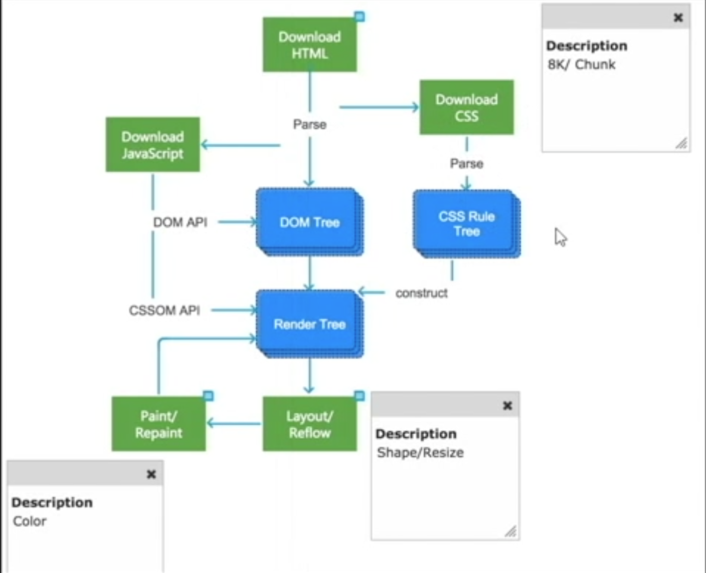
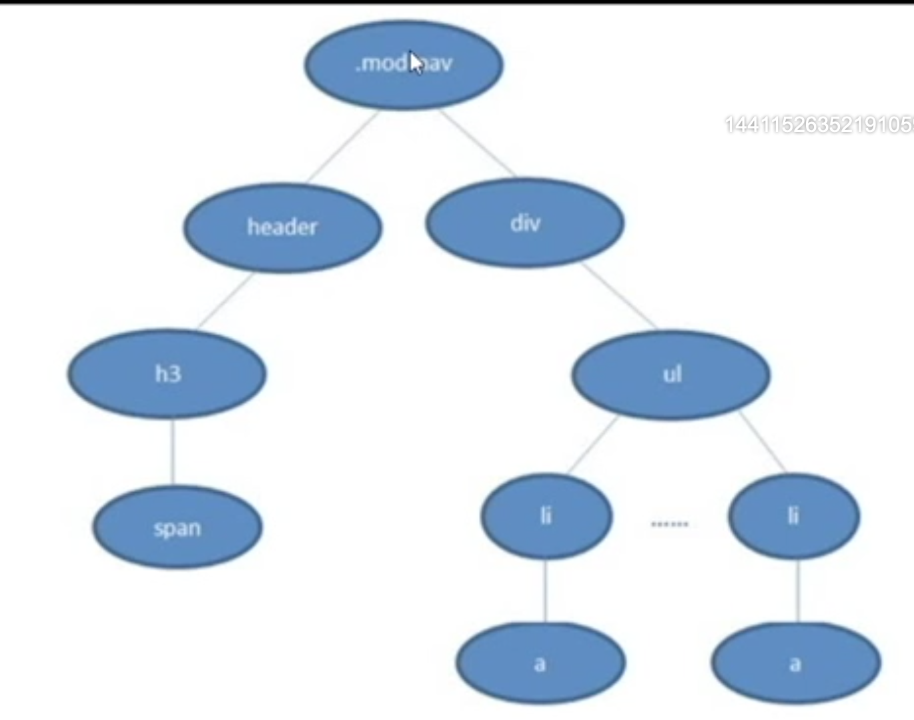

# 浏览器
## 大型浏览器
>  - google chrome webkit/blink
>  - safari webkit
>  - firefox gecko
>  - IE trident
>  - opera presto
## 内核
> - 渲染引擎
> - JS解析引擎(V8最快)
## 渲染过程

## 浏览器解析css选择器逻辑

```html
<!DOCTYPE html>
  <html lang="zh-CHS">
    <head>
      <meta charset="UTF-8" />
      <style type="text/css">
        .mod_nav header h3 span {
          font-size: 15px;
        }
      </style>
    </head>
    <body>
      <div class="mod_nav">
        <header>
          <h3>
            <span>hello<span>
          </h3>
        </header>
        <div>
          <ul>
            <li><a href="">baidu</a></li>
          </ul>
          <ul>
            <li><a href="">baidu</a></li>
          </ul>
        </div>
      </div>
    </body>  
  </html>
```
> 对于css树，浏览器从下到上，从右到左解析。因为设计跨级css(.mod_nav span)，从上到下开销很大，有可能遍历所有节点。·

# css(cascading style sheet 层叠样式表)
## 语法
> 选择器: {
>   属性名: 属性值
> }

## 盒子模型
> - 宽高 + 内边距 + 边框 + 外边距
> - 可是区域： 宽高 + 内边距 * 2 + 边框 * 2
> - body自带margin(其它：8px，IE7：16px 11px, IE8: 16px 8px)
> - 改变可视区域的写法
```css
box-sizing: border-box ｜ content-box;
/* firefox */
-moz-box-sizing: border-box;
/* chrome 低版本safari */
-webkit-box-sizing: border-box;
/* IE8以下 */
-ms-box-sizing: border-box;
/* 内核为presto */
-o-box-sizing: border-box;
```

## 类型
### 权重
> 内联样式 > 内部样式表 > 外部样式表
> !important > id选择器 > 类选择器 ｜ 属性选择器 > 标签选择器 > 通配符选择器
### 权重计算
> \*            0
> 标签，伪元素    1
> 类，属性，伪类  10
> id            100
> 内联样式       1000
> ！important   无穷
### 内联样式
```html
  <div style="font-size: 14px;"></div>
```
### 内部样式表
```html
  <head>
    <style type="text/css">
      div: {
        font-size: 14px
      }
    </style>
  </head>
```
### 外部样式表
```html
  <head>
    <!-- rel:relation,表明link与html文档的关系 -->
    <link rel="stylesheet" type="text/css" href="path"/>
  </head>
```
## 选择器
### 通配符选择器
> 作用域所有标签，用于清除某人样式
```css
  * {
    margin: none;
  }
```
### 标签选择器
```css
  div {
    background-color: red;
  }
```
### 类选择器
```css
  .container {
    background-color: red;
  }
```
### 属性选择器
> 给所有带id的标签添加属性
```css
  [id] {
    background-color: red;
  }
```
> 给所有id=box的标签添加属性
```css
  [id="box"] {
    background-color: red;
  }
```
### 派生选择器
> id选择器 + id选择器不行
```css
  strong em {
    background-color: red;
  }
```
### 并列选择器
```css
  h1.title {
    background-color: red;
  }
```
```html
  <div class="box box1"></div>
```
```css
  .box.box1 {
    background-color: blue;
  }
```

## 样式
```html
  <!DOCTYPE html>
    <html lang="zh-CHS">
      <head>
        <meta charset="UTF-8" />
        <style type="text/css">
          input,
          textarea {
            outline: none;
            /* 下列样式很少用 */
            outline-color: red;
            outline-style: dotted;
            outline-width: 20px;
          }
        </style>
      </head>
      <body>
        <input type="text" />
        <br />
        <textarea cols="20" rows="30"></textarea>
      </body>  
    </html>
```
#### width min-width max-width
```html
<!DOCTYPE html>
<html lang="en">
<head>
    <meta charset="UTF-8">
    <meta http-equiv="X-UA-Compatible" content="IE=edge">
    <meta name="viewport" content="width=device-width, initial-scale=1.0">
    <title>Document</title>
    <style type="text/css">
        div {
            width: 100%;
            /* 小于该宽度时自动换行 */
            min-width: 1440px;
            /* 超过该宽度不在延长 */
            max-width: 1600px;
            font-size: 16px;
        }
    </style>
</head>
<body>
    <div>11111111111111111111111111111111111111111111</div>
</body>
</html>
```
#### height min-height max-height overflow
```html
<!DOCTYPE html>
<html lang="en">
<head>
    <meta charset="UTF-8">
    <meta http-equiv="X-UA-Compatible" content="IE=edge">
    <meta name="viewport" content="width=device-width, initial-scale=1.0">
    <title>Document</title>
    <style type="text/css">
        div {
            width: 100%;
            /* 最小高度 */
            min-height: 1440px;
            /* 超过该高度不在延长 */
            max-height: 1600px;
            font-size: 16px;
            /* 溢出部分隐藏 */
            /* overflow: hidden; */
            /* 添加滚动条无论是否溢出, 滚动条宽度17p且占用盒子内宽度 */
            overflow: scroll;
            /* 溢出时添加滚动条 */
            overflow: auto;
        }
    </style>
</head>
<body>
    <div>11111111111111111111111111111111111111111111</div>
</body>
</html>
```
#### font-size font-weight font-style font-family color
> - font-size
>   - 浏览器默认字体大小16px 
>   - 字体大小设置的是高度，宽度是自动缩放的
> - font-weight
>   - 粗细并不随数字大小逐渐改变，仅在超过某些阈值时改变
>   - ligter normal bold bolder(不适用于所有字体)
> - font-style
>   - font-style: italic (斜体，适用有斜体的字体)
>   - font-style: oblique (倾斜，适用所有字体)
> - font-family
>   - arial通用字体，win和mac都安装的字体
#### border
> - 占据可视宽度
```html
<!DOCTYPE html>
<html lang="en">
<head>
    <meta charset="UTF-8">
    <meta http-equiv="X-UA-Compatible" content="IE=edge">
    <meta name="viewport" content="width=device-width, initial-scale=1.0">
    <title>Document</title>
    <style type="text/css">
        div {
            width: 0px;
            height: 0px;
            border-width: 100px;
            border-style: solid;
            /* 向右的三角形 */
            border-color: transparent ;
            border-left-color: wheat;
        }
    </style>
</head>
<body>
    <div></div>
</body>
</html>
```
#### 对齐
> - 针对有宽高的容器
> - text-align: left center right
> - line-height，默认22px
> - text-indent(文本缩进)
#### em
> - 相对大小，对应容器内字体大小的倍数
> - line-height: 1.2em设置行高为基础的1.2倍
#### cursor
> - 光标显示
```css
  cursor: pointer | not-allowed ...
```
#### 单行文本截断和显示省略号
```html
<!DOCTYPE html>
<html lang="en">
<head>
    <meta charset="UTF-8">
    <meta http-equiv="X-UA-Compatible" content="IE=edge">
    <meta name="viewport" content="width=device-width, initial-scale=1.0">
    <title>Document</title>
    <style type="text/css">
        div {
            width: 200px;
            height: 22px;
            border: 1px solid #000;
            /* 不换行 */
            white-space: nowrap;
            overflow: hidden;
            /* 隐藏部分加省略号 */
            text-overflow: ellipsis;
        }
    </style>
</head>
<body>
    <div>
      <span></span>
    </div>
</body>
</html>
```
#### display
> - 控制元素显示：block inline-block inline
> - 注意内联和内联块级元素的空格和换行会被转换为文本分隔符
> display: none和visiblity: hidden的区别
```html
<!DOCTYPE html>
<html lang="en">
<head>
    <meta charset="UTF-8">
    <meta http-equiv="X-UA-Compatible" content="IE=edge">
    <meta name="viewport" content="width=device-width, initial-scale=1.0">
    <title>Document</title>
    <style type="text/css">
        .box1 {
            width: 200px;
            height: 200px;
            background-color: blue;
            /* 保留在文档中占据的位置 */
            visibility: hidden;
            /* 不保留文档中的位置 */
            display: none;
        }

        .box2 {
          width: 200px;
            height: 200px;
            background-color: purple;
        }
    </style>
</head>
<body>
    <div class="box1"></div>
    <div class="box2"></div>
</body>
</html>
```
> - 多行文本垂直居中
```html
<!DOCTYPE html>
<html lang="en">
<head>
  <meta charset="UTF-8">
  <meta http-equiv="X-UA-Compatible" content="IE=edge">
  <meta name="viewport" content="width=device-width, initial-scale=1.0">
  <title>Document</title>
  <style type="text/css">
      div {
        display: table;
        width: 100px;
        height: 100px;
        border: 1px solid black;
      }

      span {
        display: table-cell;
        vertical-align: middle;
      }
  </style>
</head>
<body>
  <div class="box1">
    <span>111111111111111111111111111111111111111111111111</span>
  </div>
</body>
</html>
```

#### vertical-align
> - 解决行内块和行内元素文本对齐
```html
<!DOCTYPE html>
<html lang="en">
<head>
  <meta charset="UTF-8">
  <meta http-equiv="X-UA-Compatible" content="IE=edge">
  <meta name="viewport" content="width=device-width, initial-scale=1.0">
  <title>Document</title>
  <style type="text/css">
      .block {
        display: inline-block;
        width: 150px;
        height: 150px;
        border: 1px solid black;
        /* top|middle|bottom|px */
        vertical-align: top;
      }
  </style>
</head>
<body>
    <span class="block">123</span>
    <span>123</span>
</body>
</html>
```

### 伪类选择器
#### hover
> - 控制鼠标悬浮时的样式
```css
div:hover {
  background-color: #333;
}
```
#### disbaled
> - 设置禁用时的样式
```css
div:disabled {
  background-color: #333;
}
```
#### checked
```html
<!DOCTYPE html>
<html lang="en">
<head>
    <meta charset="UTF-8">
    <meta http-equiv="X-UA-Compatible" content="IE=edge">
    <meta name="viewport" content="width=device-width, initial-scale=1.0">
    <title>Document</title>
    <style type="text/css">
        .checkbox {
            width: 40px;
            height: 40px;
            border: 1px solid black;
        }

        .checkbox label {
            display: block;
            width: 20px;
            height: 20px;
            margin: 10px;
            background-color: #000;
            opacity: 0;
            /* 兼容IE */
            filter: alpha(opacity=0);
        }

        .checkbox input[type="checkbox"] {
          display: none;
        }

        /* 相邻兄弟选择器：同父级 相邻 在其之后 */
        .checkbox input[type="checkbox"]:checked + label {
          opacity: 100;
          /* 兼容IE */
          filter: alpha(opacity=100);
        }
    </style>
</head>
<body>
    <div class="checkbox">
      <input type="checkbox" id="checkbox"/>
      <label for="checkbox"></label>
    </div>
</body>
</html>
```
#### focus
```html
<!DOCTYPE html>
<html lang="en">
<head>
    <meta charset="UTF-8">
    <meta http-equiv="X-UA-Compatible" content="IE=edge">
    <meta name="viewport" content="width=device-width, initial-scale=1.0">
    <title>Document</title>
    <style type="text/css">
        input {
          outline: none;
        }

        input:focus {
          border: 1px solid green;
        }
    </style>
</head>
<body>
    <input type="text" />
</body>
</html>
```
#### first-child last-child
```html
<!DOCTYPE html>
<html lang="en">
<head>
    <meta charset="UTF-8">
    <meta http-equiv="X-UA-Compatible" content="IE=edge">
    <meta name="viewport" content="width=device-width, initial-scale=1.0">
    <title>Document</title>
    <style type="text/css">
        div span:first-child {
          color: red;
        }

        div span:last-child {
          color: red;
        }
    </style>
</head>
<body>
    <div>
      <span>123<span>
      <span>123<span>
      <span>123<span>
      <span>123<span>
      <span>123<span>
    </div>
</body>
</html>
```
#### nth-child
```html
<!DOCTYPE html>
<html lang="en">
<head>
    <meta charset="UTF-8">
    <meta http-equiv="X-UA-Compatible" content="IE=edge">
    <meta name="viewport" content="width=device-width, initial-scale=1.0">
    <title>Document</title>
    <style type="text/css">
      table {
        width: 300px;
      }

      table tr:nth-child(even) {
        background-color: #efefef;
      }
    </style>
</head>
<body>
    <table>
      <tr>
        <td>1</td>
        <td>1</td>
        <td>1</td>
      </tr>
      <tr>
        <td>1</td>
        <td>1</td>
        <td>1</td>
      </tr>
      <tr>
        <td>1</td>
        <td>1</td>
        <td>1</td>
      </tr>
      <tr>
        <td>1</td>
        <td>1</td>
        <td>1</td>
      </tr>
      <tr>
        <td>1</td>
        <td>1</td>
        <td>1</td>
      </tr>
    </table>
</body>
</html>
```

### 定位
#### 绝对定位
```html
<!DOCTYPE html>
<html lang="en">
<head>
    <meta charset="UTF-8">
    <meta http-equiv="X-UA-Compatible" content="IE=edge">
    <meta name="viewport" content="width=device-width, initial-scale=1.0">
    <title>Document</title>
    <style type="text/css">
        .box1 {
          /* 绝对定位之后，元素在新建图层上 */
          position: absolute;
          left: 10px;
          top: 20px;
          width: 100px;
          height: 100px;
          background-color: green:
        }

        .box2 {
          width: 200px;
          height: 200px;
          background-color: orange:
        }
    </style>
</head>
<body>
    <div class="box1"></div>
    <div class="box2"></div>
</body>
</html>
```

#### 相对定位
```html
<!DOCTYPE html>
<html lang="en">
<head>
    <meta charset="UTF-8">
    <meta http-equiv="X-UA-Compatible" content="IE=edge">
    <meta name="viewport" content="width=device-width, initial-scale=1.0">
    <title>Document</title>
    <style type="text/css">
        .box1 {
          /* 相对定位现对于自身原本的位置，定位之后，元素也在新建图层但保留原涂层的位置 */
          position: relative;
          left: 10px;
          top: 20px;
          width: 100px;
          height: 100px;
          background-color: green:
        }

        .box2 {
          width: 200px;
          height: 200px;
          background-color: orange:
        }
    </style>
</head>
<body>
    <div class="box1"></div>
    <div class="box2"></div>
</body>
</html>
```