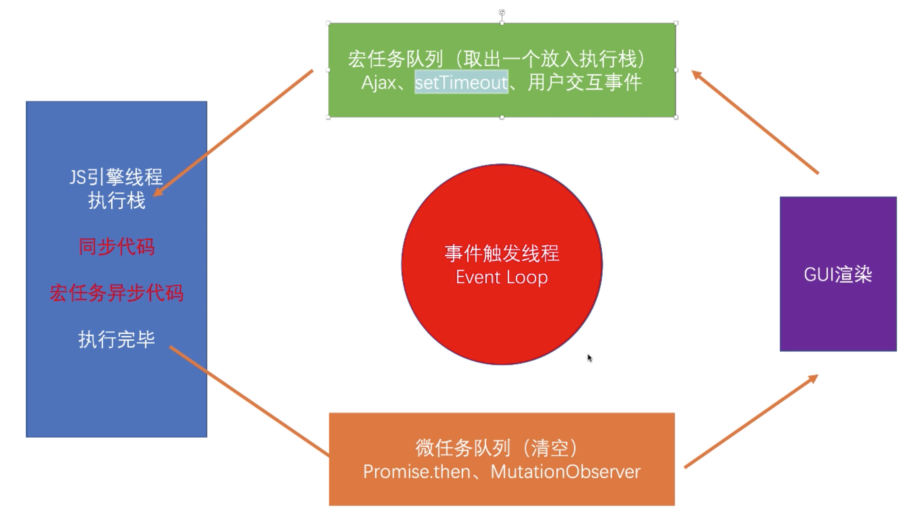

# event_loop
## 浏览器
  - 浏览器是一个多进程的应用程序（进程是对处理器，主存和IO设备的抽象）
  - 浏览器有一个主进程
  - 浏览器中的每一个tab页面都会开启一个进程
  - 每个tab也又各自有独立的渲染进程，网络进程，GPU进程插件进程
### 渲染进程
#### GUI渲染线程
  - 解析HTML, CSS
  - 构建DOM/Render树
  - 初始布局与绘制
  - 重绘与回流
#### JS引擎线程（与GUI渲染进程互斥）
  - 一个主线程与多个辅助线程配合
  - 解析JS，运行JS
  - 每个浏览器只有一个JS引擎？
#### 事件触发线程（event loop）
#### 事件线程 （用户交互事件 setTimeout ajax）
#### 宏任务与微任务
  - 创建线程的目的是为了实现异步
  - 宏任务：宿主提供的异步方法与任务（script setTimeout UI渲染）
  - 微任务：ECMA提供的API（Promise

## 任务队列

- script标签本身是一个宏任务
- 宏任务每次时间环循环只取一个
- 例子
```javascript
document.body.style.backgroundColor = 'orange'
console.log(1)

setTimeout(() => {
  document.body.style.backgroundColor = 'green'
  console.log(2)
}, 100)

Promise.resolve(3).then(num => {
  document.body.style.backgroundColor = 'purple'
  console.log(num)
})

/*
  执行栈
    color = orange
    console.log(1)
    Promise.resolve(3)
  宏任务队列
    setTimeout cb
  微任务队列
    Promise.then cb
  执行微任务队列
    color = purple
    console.log(3)
  GUI渲染
    color = purple
  宏任务
    color = green
    console.log(3)
*/
```
