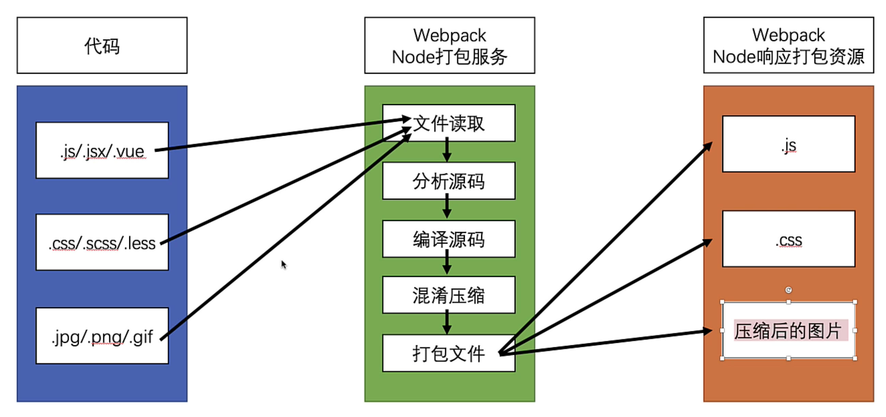
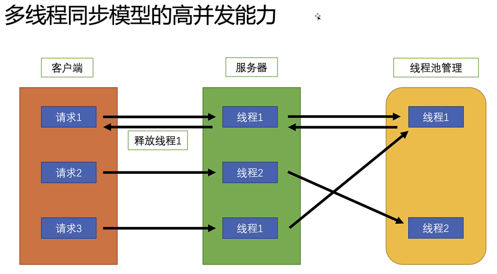
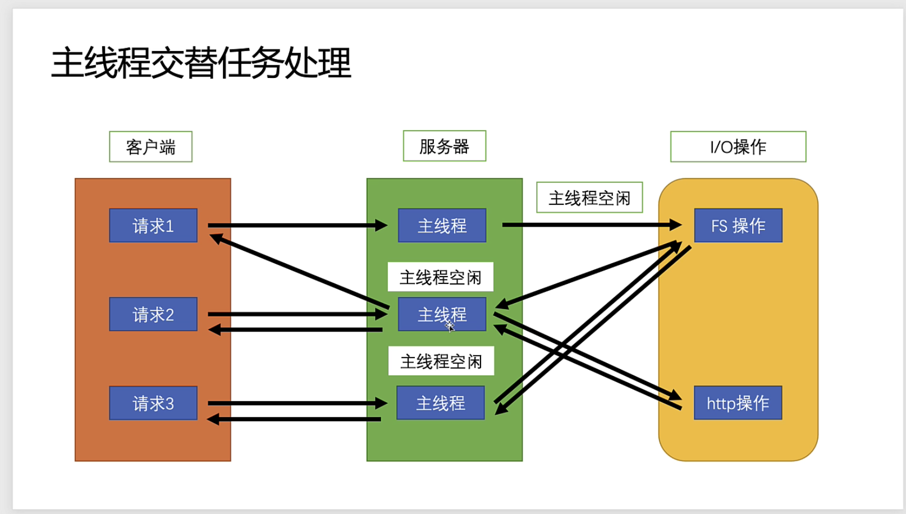
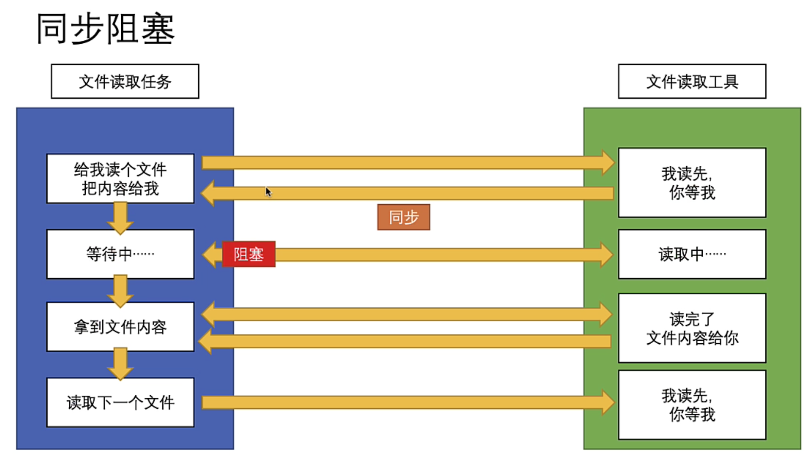
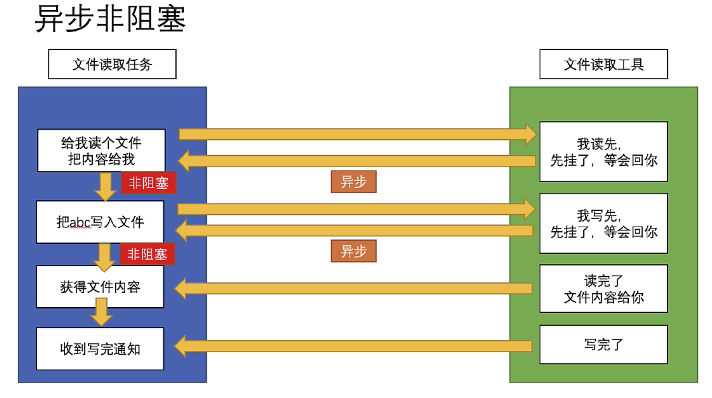
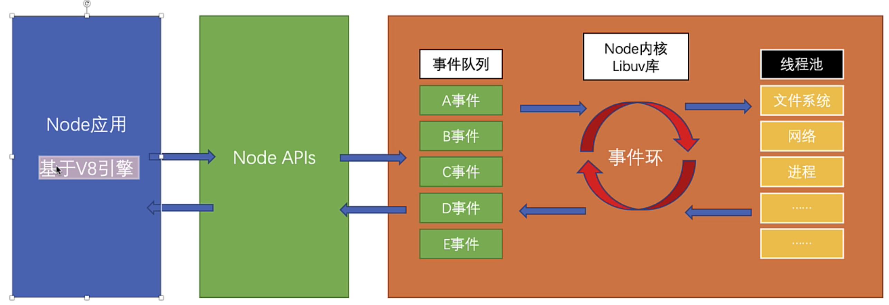
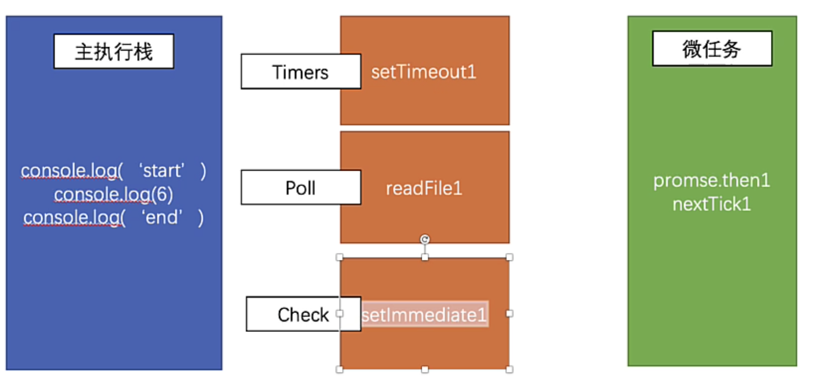

# event_loop
## 浏览器
  - 浏览器是一个多进程的应用程序（进程是对处理器，主存和IO设备的抽象）
  - 浏览器有一个主进程
  - 浏览器中的每一个tab页面都会开启一个进程
  - 每个tab也又各自有独立的渲染进程，网络进程，GPU进程插件进程
### 渲染进程
#### GUI渲染线程
  - 解析HTML, CSS
  - 构建DOM/Render树
  - 初始布局与绘制
  - 重绘与回流
#### JS引擎线程（与GUI渲染进程互斥）
  - 一个主线程与多个辅助线程配合
  - 解析JS，运行JS
  - 每个浏览器只有一个JS引擎？
#### 事件触发线程（event loop）
#### 事件线程 （用户交互事件 setTimeout ajax）
#### 宏任务与微任务
  - 创建线程的目的是为了实现异步
  - 宏任务：宿主提供的异步方法与任务（script setTimeout UI渲染）
  - 微任务：ECMA提供的API（Promise

## 任务队列

- script标签本身是一个宏任务
- 宏任务每次时间环循环只取一个
- 例子
```javascript
document.body.style.backgroundColor = 'orange'
console.log(1)

setTimeout(() => {
  document.body.style.backgroundColor = 'green'
  console.log(2)
}, 100)

Promise.resolve(3).then(num => {
  document.body.style.backgroundColor = 'purple'
  console.log(num)
})

/*
  执行栈
    color = orange
    console.log(1)
    Promise.resolve(3)
  宏任务队列
    setTimeout cb
  微任务队列
    Promise.then cb
  执行微任务队列
    color = purple
    console.log(3)
  GUI渲染
    color = purple
  宏任务
    color = green
    console.log(3)
*/
```
```javascript
  obtn = document.querySelector('#btn')
  obtn.addEventListener('click', () => {
    console.log(1)
    Promise.resolve('m1').then(str) => {
      console.log(str)
    }
  }. false)

  obtn.addEventListener('click', () => {
    console.log(2)
    Promise.resolve('m2').then(str) => {
      console.log(str)
    }
  }. false)

  // 如果是通过obtn.click()，可以理解为直接在主线程直接同时调用click的回调
  // 结果 1 2 m1 m2

  // 如果是用户调用则是click回调会被推入宏任务队列，然后按照时间还顺序执行
  // 结果 1 m1 2 m2
```

# 宏任务与微任务
## 宏任务
  ### setTimeout setImmediate
   - setImmediat仅在node edge中支持
   - 在node中setImmediate的执行是在poll phase完成后。且在IO cycle中执行是总是领先于其它定时器
  
  ### requestAnimation setInterval
   - requestAnimation 在下一次浏览器重绘之前调用调用一次 setInterval调用多次
   - requestAnimation 窗口最吓化时会暂停执行，setInterval不会
   - requestAnimation 对所有dom操作统一计算执行一次并绘制一次 setInterval 多次dom操作会进行多次计算和绘制
   - setInterval中若间隔小于刷新率会，对于dom操作执行很多无意义的重绘与重排

# NodeJs
# 基本
 1. 基于chrome v8引擎的js运行环境
 2. js运行在服务端
 3. node运行环境只包含ES,node和nodeAPI模块
 4. 事件驱动（事件完成通知，异步）
    - 通过回调通知
 5. 非阻塞式I/O(异步的输入输出)
 6. 外部依赖包与某块管理器npm
 7. 主线程交替处理任务(只有一个主线程)
 8. 擅长：I/O操作：文件读取，网络请求，数据库操作
    不擅长：CPU密集型操作 高性能逻辑运算 解压缩 数据分析(没有专门的线程执行高性能运算)
 9. node具体工作
    - 前后端分离
    - 服务端渲染
    - 前端工程化服务与工具
    
## 多线程与主线程交替执行
  
  
## JS单线程
  js主线程是单线程(运行代码)
  防止多个线程造成dom操作与渲染的任务冲突
  node中沿用了主线程与单线程的方式
  多线程与单线程的优劣
  - 多线程要频繁切换任务上下文，单线程不需要
  - 多线程处理多个任务时需要管理锁机制，单线程不需要
  
  ### 同步阻塞
  
  ```javascript
  const { readFileSync } = require('fs')
  // 同步执行，等待读取结果后再往下执行，阻塞代码
  const file1 = readFileSync('1.txt')
  const file2 = readFileSync('2.txt')
  ```
  ### 异步非阻塞
  
  ```javascript
  const { readFile } = require('fs')
  // 同步执行，等待读取结果回调，不阻塞代码继续执行
  const file1 = readFile('1.txt'， 'utf-8', function (error, data) {
    console.log(data)
  })
  const file2 = readFile('2.txt'， 'utf-8', function (error, data) {
    console.log(data)
  })
  ```

  ## Node事件环·
  1. 通过事件循环机制运行js代码
  2. 提供线程池处理I/O操作
  3. 两种线程1
     - 事件循环线程：负责安排任务(require，同步执行回调，注册新任务)
     - 线程池(libuv实现)：负责处理任务(I/O操作，CPU密集型任务)
  
  node事件即node的api
  node中并不存在事件对列，实际情况是处理node事件时直接交给对应的线程池处理

  ### 事件环阶段
  1. Timers: setTimeout/setInterval
  2. Pending callbacks:执行延迟到下一个事件环迭代的I/O回调（内部机制使用）
  3. Idle, prepare：系统内部机制使用
  4. POll：检查新的I/O事件与I/O回调
  5. Check：setImmediate
  6. Close callbacks：关闭的回调函数(内部机制使用)

  #### 事件环案例
  ```javascript
  Promise.resolve().then(res => {
    console.log(1)
  })

  //nextTick优先于Promise.then
  process.nextTick(() => {
    console.log(2)
  })

  console.log('start')

  readFile('1.txt', 'utf-8', () => {
    setTimeout(() => {
      console.log(3)
    })

    process.nextTick(() => {
      console.log(4)
    })

    setImmediate(() => {
      console.log(5)
    })
  })

  console.log(6)

  setTimeout(() => {
    console.log(7)
  })

  setImmediate(() => {
    console.log(8)
  })

  console.log('end')

  /*
  start 6 end 2 1
  */
  ```
  
