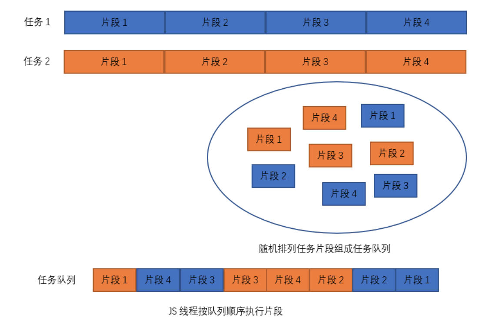
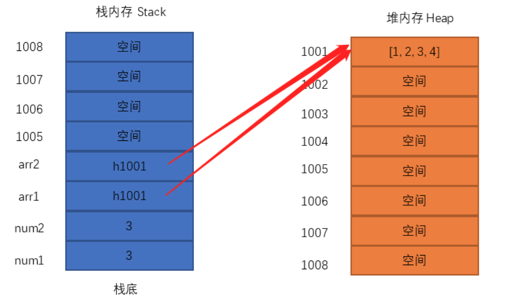

# 浏览器历史和js关系 
## 浏览器
 IE         trident
 chrome     webkit
 safari     webkit
 firefox    gecko
 opera      presto
 edge       blink

##  浏览器历史和js诞生
1. 1990
> - 蒂姆 博纳斯 李，第一个网页浏览器World Wild Web，后移植到C语言 
> - libwww(真正意义上的浏览器)，允许浏览他人编写的网站
2. 1993
> - 美国伊利诺伊大学 马克 安德森 mosaic浏览器，可以显示图片，第一个图形化网站
3. 1994 
> - 马克 安德森和吉姆 克拉克共同创立mosaic公司(伊利诺伊大学将mosaic商标转让给spy glasee公司)，为避免因商标权产生的问题，mosaic公司该名为网景公司(Netscape)
4. 1996
> - 微软收购spy glass并开发了IE浏览器
> IE3 Jscript(脚本语言)
> 网景公司Brendan Eich在net navigator上开发了livescript，并和sun公司合作推广，因此更名为javascript
5. 2001
> - IE6 -> js引擎
6. 2003
> - mozilla公司开发firefox(netscape navigator开源)
7. 2008
> - google基于webkit开发了chrome，v8引擎(独立于浏览器运行，直接翻译机器码)
8. 2009
> - oracle公司收购了sun公司

## ECMA
- European Computer Manufactures Association(欧洲计算机制造联合会)
- ECMA-262 脚本语言规范 ECMAScript
- ES5 ES6 规范化脚本语言

## 编程语言
- 编译型 解释型 脚本语言

# Javascript
1. 组成
- ECMAScript(语法，类型，语句，关键字...): 由ECMA-262定义
- DOM(Document Object Model): 提供与网页内容交互的方法和接口(W3C规范)
- BOM(浏览器对象模型): 提供与浏览器交互的方法和接口(没有规范)
2. Js引擎
> - 轮转时间片，即短时间内轮流执行多个任务的片段 

3. js引入
- 外部文件（通过src属性引入外部文件）
``` html
<script type="text/javascript" src="js/index.js">标签对内书写的js代码不会被执行</script>
```
- 内部文件
```html
<script type="text/javascript">标签对内书写的js代码会被执行</script>
```

## 变量
- 存储数据的容器
1. 声明和赋值
```javascript
// 变量声明 (向内存申请存储空间)
var a;
// 变量赋值
a = 3;  

// 变量声明并赋值 赋值运算符(=)
var b = 4;           

// 声明多个变量并赋值(变量之间用,隔开)
var c = 5,
    d = 6;           

// var 声明的变量允许被修改
var e = 1;
    e = 2;           
document.write(e);   // '2'

var sum = a + b;     // 先运算后赋值
document.write(sum); // '7'
```
2. 变量命名规范
- 不能以数字开头
- 以字母，_，$开头
- 不能使用关键字和保留字
- 语意化，结构化命名
- 小驼峰命名

## Js中值的类型
- 原始值
> - Number, String, Boolean, Undefined, null, Symbol, BigInt
- 引用值
> - object array function date Regexp
- 栈内存和堆内存
> - 栈内存
  > - 原始值存储在栈内存中
  > - 通过变量名获取栈内存中的原始值
  > - 每声明和重新赋值一个原始值，就在栈内存中开辟一个新的空间用来存放原始值
  ```javascript
  var num1 = 3;
  // 把num1的值赋值给num2
  // num2和num1是完全独立的
  var num2 = num1;
  ```
> - 堆内存
  > - 引用值存储在堆内存中
  > - 引用值的地址存储在栈内存中
  > - 引用值通过变量名获取到地址，访问引用值
  > - 引用值被赋值给另一个变量是赋值的其地址



## 显示转换与隐示转换
### 显示类型转换
#### Number()
布尔值：true为1，false为0
数值：直接返回
null：返回0
undefined：返回NaN
字符串:
>  字符串是数值字符，返回十进制数字
> 有效的浮点值格式，转换为浮点值
> 有效的十六进制格式，转换为对应的十进制数字
> 空字符串返回0
> 其它情况返回NaN
```javascript
console.log(Number('123'));     // 123
console.log(Number('1s'));      // NaN
console.log(Number(true));      // 1
console.log(Number('12.3'));    // 12.3
console.log(Number(null));      // 0
console.log(Number(undefined)); // NaN
```

#### parseInt(string, radix)
将数字转换为整数
字符串最前面的空格会被忽略，从第一个非空格字符串开始转换
如果第一个字符不是数值字符，加号或减号，parseInt返回NaN
若第一个字符是数值字符，加号或减号，则继续往后检查每个字符，直到字符串末尾或遇到非数值字符
```javascript
console.log(parseInt('12.3'));    // 12
console.log(parseInt('123str'));  // 123
console.log(parseInt('str123'));  // NaN
console.log(parseInt(null));      // NaN
console.log(parseInt(undefined)); // NaN
console.log(parseInt(true));      // NaN
console.log(parseInt('a', 16));   // 10
console.log(parseInt('')); 				// NaN
```

#### parseFloat(string)
将字符串转换为浮点数(只解析十进制)
解析到字符串末尾或第一个无效字符
第一次出现的小数点有效，第二次无效，剩余字符串被忽略
忽=忽略开头的0字符
```javascript
parseFloat('1234bb'); 				// 1234
parseFloat('0xA');						// 0
parseFloat('22.5');						// 22.5
parseFloat('22.34.5');				// 22.34
parseFloat('0908.5');					// 908.5
var sum = parseFloat('3.1415926');
console.log(sum.toFixed(2)); // 四舍五入
```

#### String()
null undefined没有toString(radix)方法

#### Boolean()
null undefined 0 '' NaN false为假，其余为真

### 隐示类型转换
#### ++ -- + - * / %
如果有不是数值的操作数则调用Number转为为数值
```javascript
var a = '123';
// Number(a)
a++;
console.log(a); // 124
var b = '3' * 2;
console.log(b); // 6
```
```javascript
// Number(false) -> 0 
var a = false + 1;
console.log(a); // 1

//----------------------------------

// Number(false) -> 0
var b = false == 1;
console.log(b); // false

//------------------------------------

/**
 * typeof(a) -> 'undefined'
 * (-true) -> Number(-true) -> -1
 * (+undefined) -> Number(+undefined) -> NaN
 * -1 + NaN + '' -> 'NaN'
 * 'undefined' && 'NaN' -> 'NaN'
 * Boolean('NaN') -> true
 */
if (typeof(a) && (-true) + (+undefined) + '') {
  console.log('通过了'); // 执行
} else {
  console.log('没通过');
}

//-----------------------------------------------------------------

/**
 * 5 * '3' -> 5 * Number('3') -> 15
 * 1 + 15 === 16 -> true
 */
if (1 + 5 * '3' === 16) {
  console.log('通过了'); // 执行
} else {
  console.log('未通过');
}

//----------------------------------------------------------------

/**
 * Boolean(' ') -> true
 * Boolean(') -> false
 * Boolean(false) -> false
 * true + false - false || '通过了'
 * Number(true) + Number(false) - Number(false) || '通过了'
 * 1 + 0 - 0 || '通过了'
 * 1 || '通过了'
 * 1
 */
console.log(!!' ' + !!'' - !!false || '通过了'); // 1``
```

#### 比较运算符
undefined null 既不等于0，也不大于0或小于0
null == undefined
null !=== undefined
```javascript
var c = '1' > 2;    // Number('1')
console.log(c);			// false
var d = 'a' > 'b';  // 按位比较ASCII码
console.log(d); //false
// 2 > 1  			true
// true > 3 		Number(true) -> 1
// 1 > 3  			false
var a = 2 > 1 > 3;
console.log(a); // false
```

#### isNaN(value)
会为value调用Number方法，然后判断
```javascript
console.log(isNaN(NaN));       // true
console.log(isNaN(undefined)); // true
console.log(isNaN(null));      // false
console.log(isNaN(37));        // false
console.log(isNaN('37'));      // false
console.log(isNaN(false));     // false
console.log(isNaN('abc'));     // true
```

## 函数
### 函数基础与种类
1. 函数作用：功能的封装，解耦合
2. 函数名命名规则与变量命名规则相同
3. 定义语法
```javascript
  // 函数声明
  function name(arg1, arg2) {}
  // 函数表达式
  var name = function(arg1, arg2) {}
```
```javascript
  var test = function test1() {
    var a = 1
        b = 2
    // 函数内部可以调用test1
    console.log(a, b) // test1
  }
  // 如果是匿名函数，则打印test
  console.log(test.name) // test1
```
### 形参与实参
1. 形参：函数定义时携带的参数
2. 实参：函数被调用时携带的参数
3. 形参个数与实参个数可以不相等
```javascript
  function test(a, b) {
    // 函数形参个数
    console.log(test.length)
    // 函数实参个数
    console.log(arguments.length)
  }
  test(1, 2, 3)
```

### arguments
1. 类数组对象
2. 存储实参列表
3. 存储的值与传入的实参不是同一个值，但与传入的实参值有映射关系
```javascript
function test(a, b, c) {
  a = 3;
  c = 5;
  console.log(arguments[0]); // 3
  console.log(arguments[2]); // undefined
}
test(1, 2);
```

### 函数作用域
1. es5中作用域分为全局作用域与函数作用域
2. 在函数内通过var定义的变量只能在函数内部生效，函数被销毁时这些变量也会销毁
```javascript
// 全局变量
a = 1;
function test1() {
  // 局部变量
  var b = 2;
  console.log(a, b);	// 1 2
  // 重新赋值全局变量a    a -> 4
  a = 4;

  function test2() {
    // 局部变量
    var c = 3;
    // 重新赋值test1内的变量b   b -> 5
    b = 5;
    console.log(b);		// 5
  }
  test2();
  // test2函数运行完时局部变量c被销毁
  console.log(c); // ReferenceError
}

test1();
```

### 参数默认值
- 没有传入实参时，形参默认为undefined
- ES6后允许在函数定义时为参数设置默认值
```javascript
function test(a = 1, b) {
  console.log(a); // 1
  console.log(b); // undefined
}
test();
```
- 设置默认值的方法
```javascript
function test1(a, b) {
  var a = arguments[0] || 2;
  var b = arguments[1] || 3
  console.log(a + b);
}
test(); // 5

function test2(a, b) {
  var a = typeof(arguments[0]) === 'undefined' ? 2 : arguments[0];
  var b = typeof(arguments[1]) === 'undefined' ? 3 : arguments[1];
  console.log(a + b);
}
test2(); // 5
```

## 预编译与AO(函数执行期上下文) GO(全局执行上下文)
### GO预编译步骤
1. 寻找变量声明并提升
2. 找函数声明并赋值
3. 执行函数
### 函数预编译步骤
1. 寻找形参并未形参做变量声明
2. 寻找变量声明并提升
3. 为形参赋实参值
4. 找函数声明并赋值
5. 执行函数
```javascript
/**
 * AO = {
 *  a : undefined -> 2 -> function a() {} -> 1
 *  b : undefined -> function() {}
 *  d : function d() {}
 * }
 */
function test(a) {
  console.log(a); // function a() {}
  var a = 1;
  console.log(a); // 1
  function a() {}
  console.log(a); // 1
  var b = function() {}
  console.log(b); // function() {}
  function d() {}
}

test(2);

//-------------------------------------------------------------

/**
 * AO = {
 *  a : undefined -> 1 -> 5
 *  b : undefined -> function b(){} -> 6
 *  c : undefined -> 0
 *  d : function d(){}
 * }
 */
function test(a, b) {
  console.log(a); // 1
  c = 0;
  var c;
  a = 5;
  b = 6;
  console.log(b); // 6
  function b(){}
  function d(){}
  console.log(b); // 6
}

test(1);

//-----------------------------------------------------------------

/**
 * GO = {
 *  a : undefinded -> function a() {} -> 2
 * }
 */
var a = 2;
function a() {
  console.log(2);
}

console.log(a); // 2

//---------------------------------------------------------------

/**
 * GO = {
 *  b : undefined	-> function() {}
 *  a : function a() {}
 * }
 */
console.log(a, b);	// function a() {}  undefined
function a() {}
var b = function() {};

//--------------------------------------------------------------

/**
 * GO = {
 *  test: function (){...}
 *  b: 1
 * }
 * 
 * AO = {
 *  a : undefined -> 1
 * }
 */

function test() {
  var a = b = 1;
  console.log(a); // 1
}

test();

//--------------------------------------------------------

/**
 * GO = {
 *  b : undefined -> 3
 *  a : function a(a) {}
 * }
 * 
 * AO = {
 *  a : undefined -> 1 -> function a() {} -> 2
 *  b : undefined -> 5
 * }
 */
var b = 3;
console.log(a); // function a(a) {}
function a(a) {
  console.log(a); // function a() {}
  var a =2;
  console.log(a); // 2
  function a() {}
  var b = 5;
  console.log(b); // 5
}

a(1);

//--------------------------------------------------------

/**
 * GO = {
 *  a : undefined -> 1
 *  test : function test() {}
 * }
 * 
 * AO = {
 *  a : undefined - > 2 -> 3
 * }
 */
a = 1;
function test() {
  console.log(a); // undefined
  a = 2;
  console.log(a); // 2
  var a = 3;
  console.log(a); // 3
}

test();
var a;

//-------------------------------------------------------------

/**
 * GO = {
 *  a : undefined -> 1
 *  test : function test() {}
 *  c : 3
 * }
 * 
 * AO = {
 *  b : undefined
 * }
 */
function test() {
  console.log(b); // undefined
  if (a) {
    var b = 2;
  }

  c = 3;
  console.log(c); // 3
}

var a;
test();
a = 1;
console.log(a); // 1

//-------------------------------
var a = 1;
    b = 2;

console.log(window.a); // 1
console.log(window.b); // 2

//---------------------------------------
function test() {
  var a = b = 1;
}

test();
// 访问对象中不存在的属性，会返回undefined
console.log(window.a); // undefined
console.log(window.b); // 1

//--------------------------
/**
 * AO = {
 *  a : undefined -> function a() {}
 * }
 */
function test() {
  // 遇到return直接返回
  return a;
  a = 1;
  function a() {}
  var a = 2;
}

console.log(test()); // function a() {}

//--------------------------------------------

/**
 * AO = {
 *  a : undefined -> function a() {} -> 1 -> 2
 * }
 */
function test() {
  a = 1;
  function a() {}
  var a = 2;
  return a;
}

console.log(test()); // 2

//------------------------------------------------

/**
 * GO = {
 *  a : undefined -> 1
 *  test: function test(e) {}
 *  f : 5
 * }
 * 
 * AO = {
 *  e : undefined -> 1 -> function e() {} -> 2
 *  b : undefined
 *  c : undefined
 *  a : undefined -> 4
 * }
 */
a = 1;
function test(e) {
  function e() {}
  arguments[0] = 2;
  console.log(e); // 2
  // 此时变量a的值为undefined，不执行if语句内容
  if (a) {
    var b = 3;
  }
  var c;
  a = 4;
  var a;
  console.log(b); // undefined
  // 暗示全局变量
  f = 5;
  console.log(c); // undefined
  console.log(a); // 4
}

var a;
test(1);
console.log(a); // 1
console.log(f); // 5
```

## 作用域，作用域链，预编译与闭包
### 作用域
[[scope]]属性是函数创建时js内部生成的隐式属性
### 作用域链
1. 决定函数在访问变量时的顺序
2. 函数在被定义时作用域链与定义该函数的执行上下文一致
3. 函数被执行时生成自己的AO
```javascript
/**
 * 1.
 * GO = {
 *  a : function a() {}
 * }
 * 2. a函数执行前生成自身的AO
 * AO = {
 *  b : function b() {}
 * }
 * 3. b函数执行前生成自身的AO
 * AO = {
 *  c : function c() {}
 * }
 * 4. c函数执行前生成自身的AO
 * AO = {}
 */
function a() {
  function b() {
    function c() {

    }
    c();
  }
  b();
}
a();

/**
 * a定义：a.[[scope]] -> 0: GO
 * a执行：a.[[scope]] -> 0: a的AO
 *                       1：GO
 * b定义：b.[[scope]] -> 0：a的AO
 *                       1：GO
 * b执行：b.[[scope]] -> 0: b的AO
 *                       1：a的AO
 *                       2：GO
 * c定义：c.[[scope]] -> 0: b的AO
 *                       1：a的AO
 *                       2：GO
 * c执行：c.[[scope]] -> 0：c的AO
 *                       1：b的AO
 *                       2：a的AO
 *                       3：GO
 * c结束：c.[[scope]] -> 0：b的AO
 *                       1：a的AO
 *                       2：GO
 * b结束：b.[[scope]] -> 0：a的AO
 *                       1：GO
 *        c.[[scope]]销毁
 * a结束：a.[[scope]] -> 0: GO
 *        b.[[scope]] -> 销毁
 */
```
### 闭包
1. 当内部函数被返回到外部保存时，一定会产生闭包
2. 闭包会导致作用域链中的作用域不被释放
3. 过度的闭包会导致内存泄漏
```javascript
/**
 * GO = {
 *  c : undefined -> 3
 *  test3 : undefined -> function test2() {}
 *  test1 : function test1() {}
 * }
 * 
 * test1的AO
 * AO = {
 *  a : undefined -> 1
 *  test2: function test2() {}
 * }
 * 
 * test2的AO
 * AO = {
 *  b : undefined -> 2
 * }
 */
function test1() {
  function test2() {
    var b = 2;
    console.log(a);	// 1
  }
  var a = 1;
  return test2;
}
var c = 3;
var test3 = test1();
test3();

/**
 * test1定义: test1.[[scope]] -> 0: GO
 * test1执行: test1.[[scope]] -> 0: test1的AO
 *                               1：GO
 * test2定义: test2.[[scope]] -> 0: test1的AO
 *                               1：GO
 * test2执行: test2.[[scope]] -> 0: test2的AO
 *                               1: test1的AO
 *                               2：GO
 * test1结束: test1.[[scope]] -> 0: GO
 * test2结束: test2.[[scope]] -> 0: test1的AO
 *                               1: GO
 *            test1.[[scope]] 销毁
 * 
 */

//--------------------------------------------------------------------------

/**
 * GO = {
 *  arr : undefined -> [add, reduce]
 *  test: function test() {}
 * }
 * 
 * AO = {
 *  n : undefined -> 100
 *  add : function add() {}
 *  reduce: function reduce() {}
 * }
 * 
 */
function test() {
  var n = 100;
  function add() {
    n++;
    console.log(n);
  }

  function reduce() {
    n--;
    console.log(n);
  }

  return [add, reduce];
}

var arr = test();
arr[0]();
arr[1]();

/**
 * test定义： test.[[scope]]  -> 0 : GO
 * test执行:  test.[[scope]]  -> 0 : test的AO
 *                               1 : GO
 * add定义:   add.[[scope]]   -> 0: test的AO
 *                               1: GO
 * add执行:   add.[[scope]]   -> 0: add的AO
 *                               1: test的AO
 *                               2: GO
 * reduce定义:  reduce.[[scope]] -> 0: test的AO
 *                                  1: GO
 * reduce执行： reduce.[[scope]] -> 0: reduce的AO
 *                                  1: test的AO
 *                                  2: GO
 */

//--------------------------------------------------------------------------

/**
 * GO = {
 *  sunSched : undefined -> function sunSched() {} -> {...}
 * }
 * 
 * AO = {
 *  sunSched : undefined -> ''
 *  operation: undefined -> {...}
 * }
 * 
 */
function sunSched() {
  var sunSched = '';

  var operation = {
    setSched: function(thing) {
      sunSched = thing;
    },
    showSched: function() {
      console.log('My schedule on sunday is ' + sunSched);
    }
  }

  return operation;
}

var sunSched = sunSched();

sunSched.setSched('studying');
sunSched.showSched();
/**
 * sunSched定义：sunSched.[[scope]] -> 0: GO
 * sunSched执行：sunSched.[[scope]] -> 0: sunSched的AO
 *                                     1: Go
 * setSched定义: setSched.[[scope]] -> 0: sunSched的AO
 *                                     1: Go
 * showSched定义: showSched.[[scope]] -> 0: sunSched的AO
 *                                       1: Go
 */

function test() {
  var arr = [];

  for (var i = 0; i < 10; i++) {
    arr[i] = function () {
      document.write(i + ' ');
    }
  }

  return arr;
}

var arr = test();

for (var j = 0; j < 10; j++) {
  arr[j](); // 10个10
}
//---------------------------------------------------------------
function test() {
  var arr = [];

  for (var i = 0; i < 10; i++) {
    (function (j) {
      arr[j] = function () {
        document.write(j + ' ');
      }
    })(i)
  }

  return arr;
}

var arr = test();

for (var j = 0; j < 10; j++) {
  arr[j](); // 0-9
}
//---------------------------------------------------------------
function test() {
  for (var i = 0; i < 10; i++) {
    (function () {
      document.write(i, ' ');
    })();
  }
}

test(); // 0-9
//-------------------------------------------------------------------
<body>
  <ul>
    <li>0</li>
    <li>1</li>
    <li>2</li>
    <li>3</li>
    <li>4</li>
  </ul>
  <script type=text/javascript>
    var oLi = document.querySelectorAll('li');
    var oLength = oLi.length;
    // for (var i = 0; i < oLength; i++) {
    //   oLi[i].onclick = function() {
    //     console.log(i);
    //   }
    // }

    for (var i = 0; i< oLength; i++) {
      (function (j) {
        oLi[j].onclick = function() {
          console.log(j);
        }
      })(i)
    }
  </script>
</body>

function sum() {
  var n = 0;
  function add() {
    n++;
    console.log(n);
  }
  return add;
}

var add = sum();
add();
add();
add();
add();
```

### 立即执行函数
- IIFE(immediaely invoked function expression)
- 自动执行，执行完成以后立即释放，常用于初始化函数
- 一定是表达式才能被执行符号执行
- 括号里的都是表达式，表达式会忽略函数名称
- 写法
```javascript
;(function() {})();

// w3c推荐
;(function() {}());
```
- 传参
```javascript
// 形参
;(function(a, b) {
  console.log(a + b); // 3
})(1, 2); // 实参
```
- 返回值
```javascript
var sum = (function(a, b) {
  return a + b;
})(5, 6);
console.log(sum); // 11
```
- 函数声明转换为表达式的写法
```javascript
+function test1() {
  console.log(1);
}();

-function test2() {
  console.log(2);
}();

!function test3() {
  console.log(3);
}();

true && function test4() {
  console.log(4);
}();

false || function test5() {
  console.log(5);
}();

void function test6() {
  console.log(6);
}();

2, 3, function test7() {
  console.log(7);
}();

var a = 10;
if (function b(){}) {   //()表达式，忽略函数名
  a += typeof(b);
}

console.log(a); // '10undefined'
```

## 对象 
```javascript
// 字面量
var teacher = {
  name: '张三',
  age: 32,
  sex: 'male',
  height: 176,
  weight: 130,
  teach: function () {
    console.log('I am teaching JavaScript');
  },
  smoke: function () {
    console.log('I am smoking');
  },
  eat: function () {
    console.log('I am having a dinner');
  }
}

// 增加属性/方法
teacher.email = '350604967@qq.com';
teacher.drink = function () {
  console.log('I am drinking');
}

// 修改属性/方法
teacher.age = '25';
teacher.teach = function () {
  console.log('I am teaching HTML');
}

// 删除属性/方法
delete teacher.name;
delete teacher.eat;

console.log(teacher);
//--------------------------------------------------------------------------
var attendance = {
  students: [],
  total: 6,
  join: function(name) {
    this.students.push(name);
    if (this.students.length === this.total) {
      console.log(name + '到课，学生已到齐');
    } else {
      console.log(name + '到课，学生未到齐');
    }
  },
  leave: function(name) {
    var idx = this.students.indexOf(name);
    if (idx !== -1) {
      this.students.splice(idx, 1);
    }
    console.log(name + '早退');
    console.log(this.students);
  },
  classOver: function() {
    this.students = [];
    console.log('已下课');
  }
}

attendance.join('张三');
attendance.join('李四');
attendance.join('王五');
attendance.join('赵六');
attendance.join('小红');
attendance.join('小明');

attendance.leave('王五');

attendance.classOver();
```

### 构造函数与实例化
1. 自定义构造函数建议大驼峰命名
2. 通过new关键字创建实例化对象
3. 构造函数中的this指向实例化对象
```javascript
function Teacher() {
  this.name = '张三';
  this.sex = '男';
  this.weight = 130;
  this.smoke = function () {
    this.weight--;
    console.log(this.weight);
  }
  this.eat = function () {
    this.weight++;
    console.log(this.weight);
  }
}

var t1 = new Teacher();
var t2 = new Teacher();

t2.name = '李四';
t1.smoke(); // 129
t1.smoke(); // 128
t2.smoke(); // 129
//--------------------------------------------------------
//初始化构造函数
function Teacher(name, sex, weight, course) {
  this.name = name;
  this.sex = sex;
  this.weight = weight;
  this.course = course;
}

var t1 = new Teacher('李四', '女', 150, 'HTML');
console.log(t1);
//-----------------------------------------------------------
function Teacher(opt) {
  this.name = opt.name;
  this.sex = opt.sex;
  this.weight = opt.weight;
  this.course = opt.course;
  this.smoke = function () {
    this.weight--;
    console.log(this.weight);
  }
  this.eat = function () {
    this.weight++;
    console.log(this.weight);
  }
}

var t1 = new Teacher({
  name: '张三',
  sex: '男',
  weight: 145,
  course: 'JS'
})
```

### 原型与原型链
1. 原型prototype是function对象的一个属性，它本身也是一个对象
2. prototype是构造函数构造出的每个实例的公共祖先
3. 构造函数实例化过程
 - 在内存中创建一个新对象
 - 新对象内部的[[ prorotype ]]特性被赋值为构造函数的prototype属性
 - 构造函数内部的this指向这个新对象
 - 执行构造函数中的代码
 - 如果构造函数返回非空对象，则返回这个非空对象，否则返回this
4. 实例化对象通过__proto__属性向上查找属性和方法的链条就叫做原型链
5. 每个由相同函数构造出得实例化对象共享一个__proto__，即构造函数的prototype属性
6. 可以通过实例修改原型上的应用属性，但不能修改原始属性。修改原始属性会在实例上生成新的属性
```javascript
// Professor原型上添加属性
Professor.prototype.tSkill = 'JAVA';
function Professor() {}
// 实例化一个Professor对象
var professor = new Professor();

// Teacher构造函数原型指向professor对象
Teacher.prototype = professor;
function Teacher() {
  this.mSkill = 'jS/JQ';
  this.success = {
    alibaba: '28',
    tencent: '30'
  }
  this.students = 500;
}

// 实例化一个Teacher对象
var teacher = new Teacher();
// Student构造函数原型指向teacher对象
Student.prototype = teacher;
function Student() {
  this.pSkill = 'HTML/CSS';
}
// 实例化一个Student对象
var student = new Student();
/**
 * 1. student对象没有success属性，沿着原型链向上查找
 * 2.	student.success = student.__proto__.success
 * 3. student.students.baidu = '100'
 * 4. student.success.alibaba = '29'
 */
student.success.baidu = '100';
student.success.alibaba = '29';
/**
 * 1. student对象没有students属性，students被视为原始属性
 * 2.	student.students = student.__proto__.student
 * 3. students被添加为student上的属性
 * 3. student.students++
 */
student.students++;
console.log(teacher, student);
```

### Object,create()方法
Object.create(obj || null)返回一个新对象，该对象的原型为obj或null
```javascript
// 创建obj1空对象
// 不是所有的对象都继承于Object.prototype
var obj1 = Object.create(null);
console.log(obj1);
obj1.num = 1;
var obj2 = Object.create(obj1);
console.log(obj2);
console.log(obj2.num);

var obj = Object.create(null);

obj.num = 1;

var obj1 = {
  count: 2
}

obj.__proto__ = obj1;
// 给空对象添加__proto__属性无效
console.log(obj.count); // undefined
```

### toString方法
1. undefined和null没有toString方法，因为不能被转换为包装类
```javascript
var num = 1;
// 原始值没有属性和方法
num.toString();
// new Number(1) -> toString();
var num2 = new Number(num);
console.log(num2.toString());
```
2. 可以通过toString方法判断对象类型
```javascript
var toString = Object.prototype.toString;
console.log(toString.call(1));    // [object Number]
console.log(toString.call('a'));  // [object String]
console.log(toString.call(true)); // [object Boolean]
console.log(toString.call([]));   // [object Array]
console.log(toString.call({}));   // [object Object]
```

### call和apply方法，改变被调用函数中的this指向
```javascript
function Car(brand, color) {
  this.brand = brand;
  this.color = color;
  this.run = function () {
    console.log('running');
  }
}

var newCar = {
  displacement: '3.0'
};
// Car.call(newCar, 'Benz', 'red');
Car.apply(newCar, ['Benz', 'red']);
console.log(newCar);
var car = new Car('Benz', 'red');
console.log(car);

function Compute() {
  this.plus = function (a, b) {
    console.log(a + b);
  }

  this.minus = function (a, b) {
    console.log(a - b);
  }
}

function FullCompute() {
  Compute.apply(this);
  this.mul = function (a, b) {
    console.log(a * b);
  }

  this.div = function (a, b) {
    console.log(a / b);
  }
}

var compute = new FullCompute();
compute.plus(1, 2);
compute.minus(1, 2);
compute.mul(1, 2);
compute.div(1, 2);
```

### 继承
1. 通过new实例化出来的对象继承构造函数的原型，即prototype属性
   - 存在多个实例共享一个原型对象，修改某个实例的原型时，其它实例的原型也会被修改
```javascript
  //公共原型
function Teacher() {
  this.name = 'Mr. Li';
  this.tSkill = 'JAVA';
}

Teacher.prototype = {
  pSkill: 'JS/JQ'
}

var t = new Teacher();
console.log(t);

function Student() {
  this.name = 'Mr. Wang';
}

Student.prototype = Teacher.prototype;
Student.prototype.age = 18;

var s = new Student();

console.log(s);
  ```
2. 通过更改实例的__proto__属性可以实现继承
```javascript
Professor.prototype = {
  name: 'Mr. Zhang',
  tSkill: 'JAVA'
}
function Professor() {}

var professor = new Professor();

Teacher.prototype = professor;
function Teacher() {
  this.name = 'Mr. Wang';
  this.mSkill = 'JS/JQ';
}

var teacher = new Teacher();

Student.prototype = teacher;
function Student() {
  this.name = 'Mr. Li';
  this.pSkill = 'HTML/CSS';
}

var student = new Student();
console.log(student);
```

3. 圣杯模式实现继承
   通过创建一个缓冲类的实例，把该实例作为继承实例的原型来避免共享实例
```javascript
function inherit(Target, Origin) {
  function Buffer() {}
  Buffer.prototype = Origin.prototype
  Target.prototype = new Buffer()
  Target.prototype.constructor = Target
  Target.prototype.supper_class = Origin
}

function Teacher() {}
function Student() {}
inherit(Student, Teacher);
var s = new Student();
var t= new Teacher();

console.log(s);
console.log(t);
```
```javascript
// IIFE
var inherit = (function () {
  var Buffer = function () { }
  return function (Target, Origin) {
    Buffer.prototype = Origin.prototype;
    Target.prototype = new Buffer();
    Target.prototype.constructor = Target;
    Target.prototype.super_class = Origin;
  }
})();

Teacher.prototype.name = 'Mr. Zhang';
function Teacher() { }
function Student() { }
inherit(Student, Teacher);
Student.prototype.age = 18;
var s = new Student();
var t = new Teacher();

console.log(s);
console.log(t);
```

## js模块化开发
  通过闭包来实现命名空间，实现每个模块相互独立
```javascript
window.init = function () {
  init()
}

var init = (function () {
  ....
  return function() {}
})()

var initProgrammer = (function () {
  var Programmer = function () {}
  Programmer.prototype = {
    name: '程序员',
    tool: '计算机',
    work: '编写应用程序',
    duration: '10个小时',
    say: function () {
      console.log('我是一名' + this.myName + this.name + ', 我的工作是用' + this.tool + this.work + ', 我每天工作' + this.duration + '，我的工作需要用到' + this.lang.toString() + '。');
    }
  }

  function FrontEnd() {}
  function BackEnd() {}

  inherit(FrontEnd, Programmer);
  inherit(BackEnd, Programmer);

  FrontEnd.prototype.lang = ['HTML', 'CSS', 'JavaScript'];
  FrontEnd.prototype.myName = '前端';

  BackEnd.prototype.lang = ['Node', 'Java', 'SQL'];
  BackEnd.prototype.myName = '后端';

  return {
    FrontEnd: FrontEnd,
    BackEnd: BackEnd
  }
})();

var frontEnd = new initProgrammer.FrontEnd();
var backEnd = new initProgrammer.BackEnd();
frontEnd.say();
backEnd.say();
```