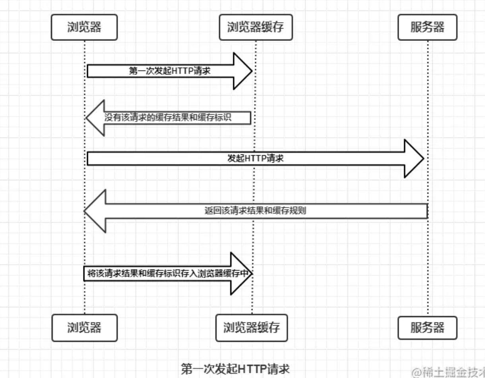
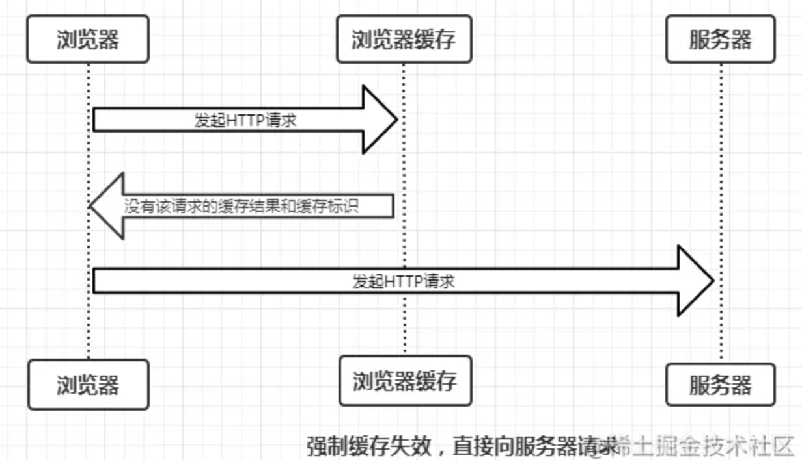
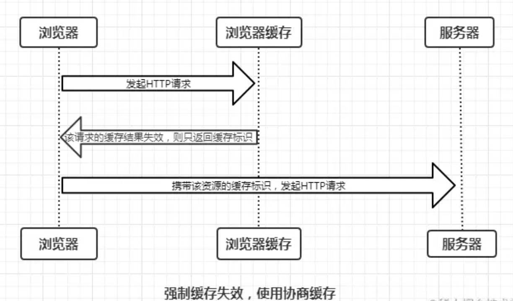
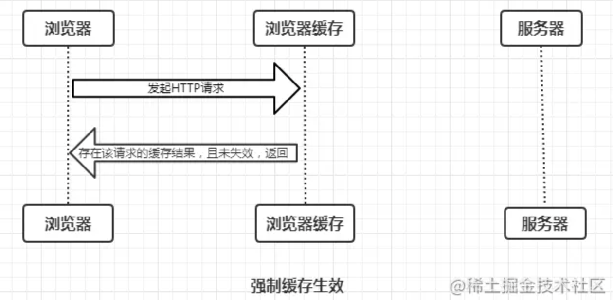
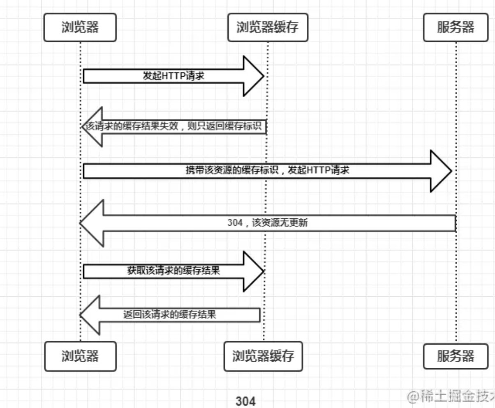
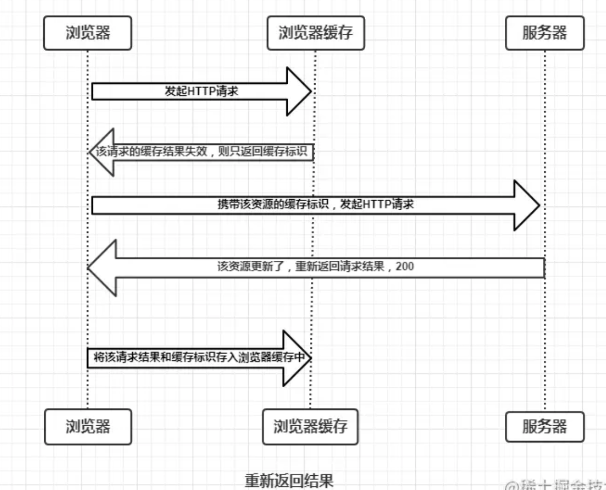
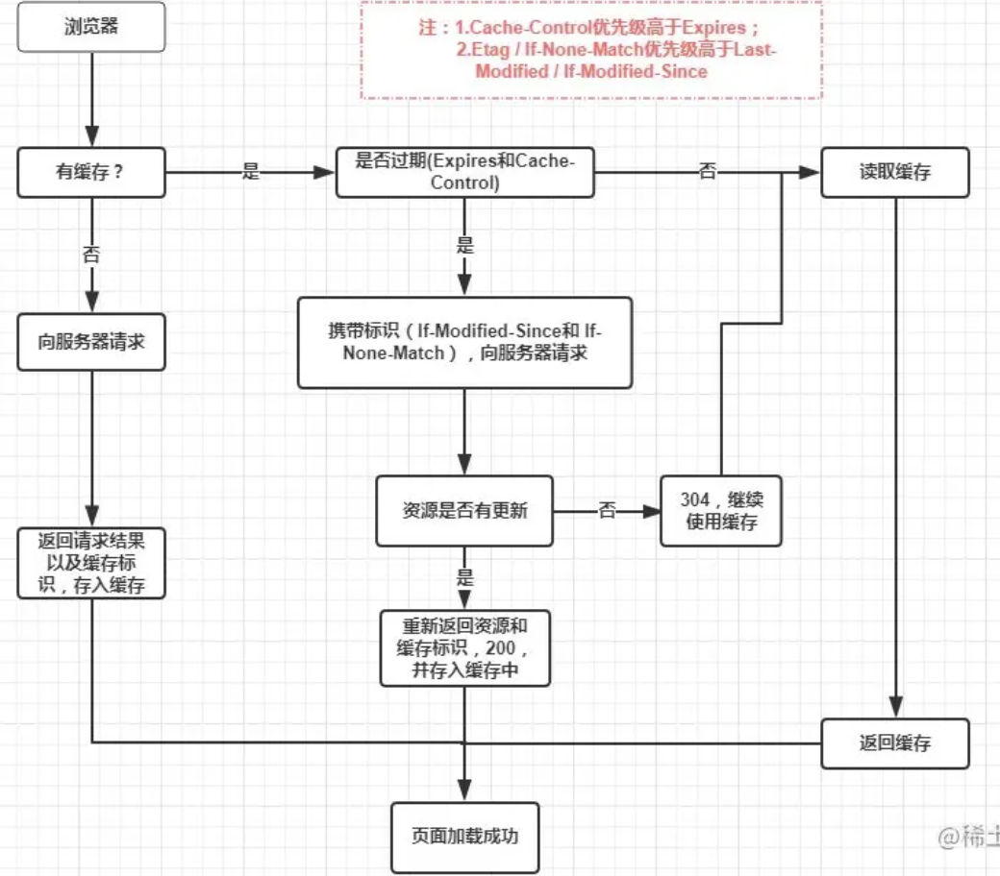

# 重绘与回流
 - 当js对页面节点操作时，会引起重绘或回流 + 重绘
## 重绘
  - 浏览器重新构建受影响部分的渲染树就是重绘
  - 不一定由回流引起
  - 更改除引起回流的其它样式时，会引起重绘(背景颜色)

## 回流
  - 回流就是renderTree改变
  - 一定引起重绘
  - 节点的尺寸，布局(位置)，display属性被改变时，节点增删，renderTree中一部分需要重新构建，引起回流
  - 一个页面必定有一次回流(初始构建renderTree引起)
  - 引起回流的因素
    1. dom节点增加与删除
    2. dom节点位置变化
    3. 元素的尺寸，边距，边框，宽高
    4. dom节点显示与否 display
    5. 页面渲染初始化
    6. 浏览器窗口尺寸变化
    7. 向浏览器请求某些样式信息(offset, scroll, client, width, height, getComputedStyle, currentStyle)
  - 现代浏览器优化回流操作：
    - 对于会引起回流的操作会加入待执行队列，待队列条目或周期事件到，在批量执行回流操作
    - 困难，对于向浏览器请求某些样式信息(offset, scroll, client, width, height, getComputedStyle, currentStyle)的操作，浏览器会强行刷新待执行队列(为防止获取的数据不准确)，因此这些操作不能通过批量操作优化
  - 减少回流操作的方法
    - 思想为将多个节点操作简化为批量处理节点操作
    - 修改类名改变样式，浏览器批量处理，只有一次回流。
    - this.style.cssText修改样式，适用于动态计算样式
    ```javascript
      width = 100
      heigth = 100
      this.style.cssText = '\
        width: ' + width + 'px;\
        heigth: ' + height + 'px;\  
      '
    ```
    - createDocumentFragment
    ```javascript
    var oFragment = document.createDocumentFragment() // 节点容器
    for (vat i = 0; i < 10; i++) {
      var oDiv = document.createElement('div')
      oDiv.className = 'box'
      oFragment.appendChild(oDiv)
    }
    document.body.appendChild(oFragment)
    ```
  - display: none
    - 原理是dislay: none的元素并不会在渲染树上，所以操作这些节点不会引起回流
    - 只会回流两次
    ```javascript
    var oBox = document.getElementsByClassName('box')[0]
    oBox.onMouseover = function() {
      oBox.style.display = none
      // ...操作该节点
      oBox.style.display = block
    }
    ```
  - 对于offset client等，若是静态的就是用缓存；动态使用getComputedStyle
  - 对于动画元素，将其positin: absolute。使动画元素在另一层，回流与重绘不会影响父级
  
# 时间线
定义：浏览器加载页面开始到加载完全结束的过程中发生的事情
1. 创建document对象
2. 解析文档，构建DOM树
   document.readyState = 'loading'
3. link开启新线程 -> 异步加载css外部文件 style -> cssdom
4. 没有设置异步加载的script，阻塞文档解析。等待js脚本加载并且解析完成后再继续解析文档
5. 异步加载的script，不阻塞文档解析(不能使用document.write)
6. 解析文档遇到img 先解析节点。对于src属性，创建加载线程，异步加载图片资源，不阻塞文档解析
7. 文档解析完成
   document.readyState = 'interactive'
8. 文档解析完成后： defer执行的script标签 按照顺序执行; async加载的script标签直接执行，不等待文档解析完成
9.  DOMContentLoaded事件 从同步脚本执行阶段 -> 事件驱动阶段
10. async script加载并执行完成，img等资源加载完毕，window.onload事件才能触发 document.readyState = 'complete'
```javascript
function domReady(fn) {
  if (document.addEventListener) {
    document.addEventListener('DOMContentLoaded', function () {
      // DOMContentLoaded事件只用触发一次，触发后执行fn应该删除
      document.removeEventListener('DOMContentLoaded', arguments.callee, false)
    }, false)
    fn()
  } else if (document.attachEvent) {
    document.attachEvent('onreadystatechange', function () {
      if (this.readyState === 'complete') {
        document.detachEvent('onreadystatechange', arguments.callee)
        fn()
      }
    })
  }

  if (document.documentElement.doScroll && typeof(window.frameElement) === 'undefined') {
    try {
      document.documentElement.doScroll('left')
    } catch (error) {
      return setTimeout(arguments.callee, 20)
    }
    fn()
  }
}
```

# 浏览器进程
## bower进程
 - 每一个网页是一个进程
## 第三方插件进程
## GPU进程
## 浏览器渲染进程(浏览器内核)
  - 浏览器内核是多线程的
    1. js 引擎线程（单线程）
    2. GUI线程（与js引擎线程互斥）
    3. http网络请求线程 webapis
    4. 定时器触发线程
    5. 浏览器事件处理线程
  - 计算量大时的解决方案
    1. ssr
    2. webwork(禁止操作dom)
    3. 异步，通过事件驱动的形式来实现异步。由除了js线程之外其它的线程处理的事件，就是异步事件

# 浏览器缓存
## 缓存过程
浏览器与服务器的通信方式为应答模式，即浏览器发起http请求-服务器响应该请求。浏览器第一次发起请求拿到结果后，根据http响应报文的缓存表示决定是否缓存结果，是否将请求结果和缓存标识存入浏览器中

- 浏览器每次发器请求时都会先在浏览器缓存中查找是否有该请求的缓存结果和缓存标识
- 浏览器每次拿到请求结构都会将请求结果和缓存标识存入浏览器中

## 强制缓存和协商缓存
根据是否需要向服务器重新发送http请求将缓存过程分为协商缓存和强制缓存
### 强制缓存
强制缓存就是当浏览器向服务器请求后，服务器会将缓存规则放入响应的响应头中，控制强制缓存的字段分别是Cache-Control和Expires。主要有以下三种情况
- 不存在请求的缓存结果和缓存标识，强制缓存失效，直接向服务器发送请求

- 存在该缓存结果和缓存标识，但缓存失效，使用协商缓存(暂不包含在图中)

- 存在缓存结果和缓存标识，缓存有效，直接使用缓存结果

#### Expires和Cache-Control
- Cache-Control优先级高于Expires
- Expires是http1.0使用的，控制浏览器缓存有效时间的字段。值是绝对时间。
- Cache-Control是http1.1使用的，用来控制浏览器缓存有效时间的字段。取值有很多，可以参考mdn
- Cache-Control主要解决了Expires中客户端和服务端时间不一致的问题(如时区不同)
- Cache-Control的取值有如下几种
  1. public: 所有内容都可以被缓存(客户端和代理服务器都可缓存)
  2. private：所有内容只有客户端可以缓存，Cache-Control的默认取值
  3. no-cache：所有内容只有客户端可以缓存，但是是否使用需要协商缓存来确定结果
  4. no-store：所有内容都不缓存，强制缓存和协商缓存都不使用
  5. max-age=xxx (xxx is numeric)：缓存内容将在xxx秒后失效
- 在浏览器中，浏览器会在js和图片等文件解析执行后直接存入内存缓存中，那么当刷新页面时只需直接从内存缓存中读取(from memory cache)；而css文件则会存入硬盘文件中，所以每次渲染页面都需要从硬盘读取缓存(from disk cache)
### 协商缓存
协商缓存就是当强制缓存失效后，浏览器携带缓存标识向服务器发送请求，由服务器根据缓存标识决定是否使用缓存，主要有以下两种情况
- 协商缓存生效，返回304

- 协商缓存失败，返回200和响应结果

协商缓存的请求标识也是在响应头只能够返回给浏览器的，控制协商缓存的字段是Last-Modified/If-Modified-Since和Etag/If-None_Match。Etag(md5)/If-None_Match优先级高于Last-Modified/If-Modified-Since
为什么要有 Etag ？HTTP1.1 中 Etag 的出现主要是为了解决几个 Last-Modified 比较难解决的问题：
1. 一些文件也许会周期性的更改，但是内容并不改变(仅仅改变的修改时间)，这个时候我们并不希望客户端认为这个文件被修改了，而重新 GET；
2. 某些文件修改非常频繁，比如在秒以下的时间内进行修改，(比方说 1s 内修改了 N 次)，If-Modified-Since 能检查到的粒度是秒级的，使用 Etag 就能够保证这种需求下客户端在 1 秒内能刷新 N 次 cache。
某些服务器不能精确的得到文件的最后修改时间。
## 总结
强制缓存优先于协商缓存进行，若强制缓存(Expires和Cache-Control)生效则直接使用缓存，若不生效则进行协商缓存(Last-Modified / If-Modified-Since和Etag / If-None-Match)，协商缓存由服务器决定是否使用缓存，若协商缓存失效，那么代表该请求的缓存失效，重新获取请求结果，再存入浏览器缓存中；生效则返回304，继续使用缓存，主要过程如下


